

::: {.grid}

::: {.g-col-6 .g-col-md-4 .g-col-lg-3}
::: {.card .h-100}
[**Frames Layout**](examples/frames/frames.qmd){.card-title .stretched-link}
[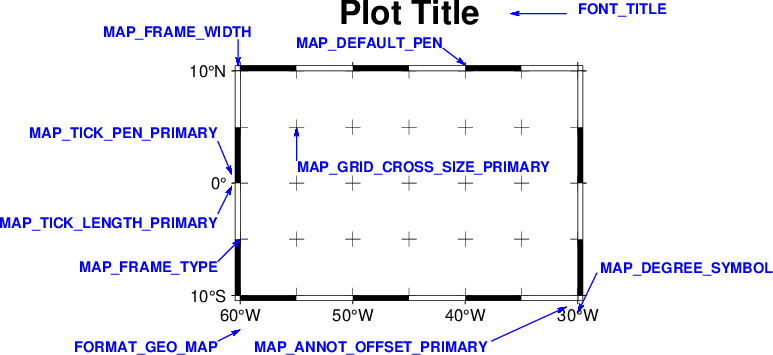{.card-img-top}](examples/frames/frames.qmd)
:::
:::

::: {.g-col-6 .g-col-md-4 .g-col-lg-3}
::: {.card .h-100}
[**Plot Examples**](examples/plotting_functions/index.html){.card-title .stretched-link}
[{.card-img-top}](examples/plotting_functions/index.html)
:::
:::

::: {.g-col-6 .g-col-md-4 .g-col-lg-3}
::: {.card .h-100}
[**Projections**](examples/projections/index.html){.card-title .stretched-link}
[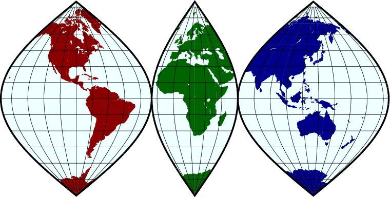{.card-img-top}](examples/projections/index.html)
:::
:::

::: {.g-col-6 .g-col-md-4 .g-col-lg-3}
::: {.card .h-100}
[**Color maps**](examples/CPTs/01_cpt_hinge.qmd){.card-title .stretched-link}
[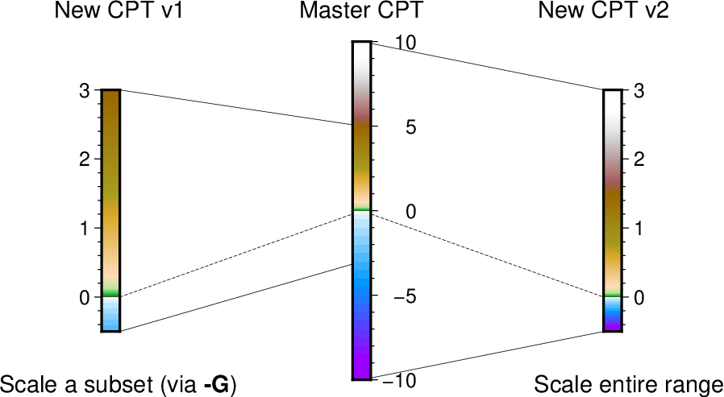{.card-img-top}](examples/CPTs/01_cpt_hinge.qmd)
:::
:::

::: {.g-col-6 .g-col-md-4 .g-col-lg-3}
::: {.card .h-100}
[**Images**](examples/images/index.html){.card-title .stretched-link}
[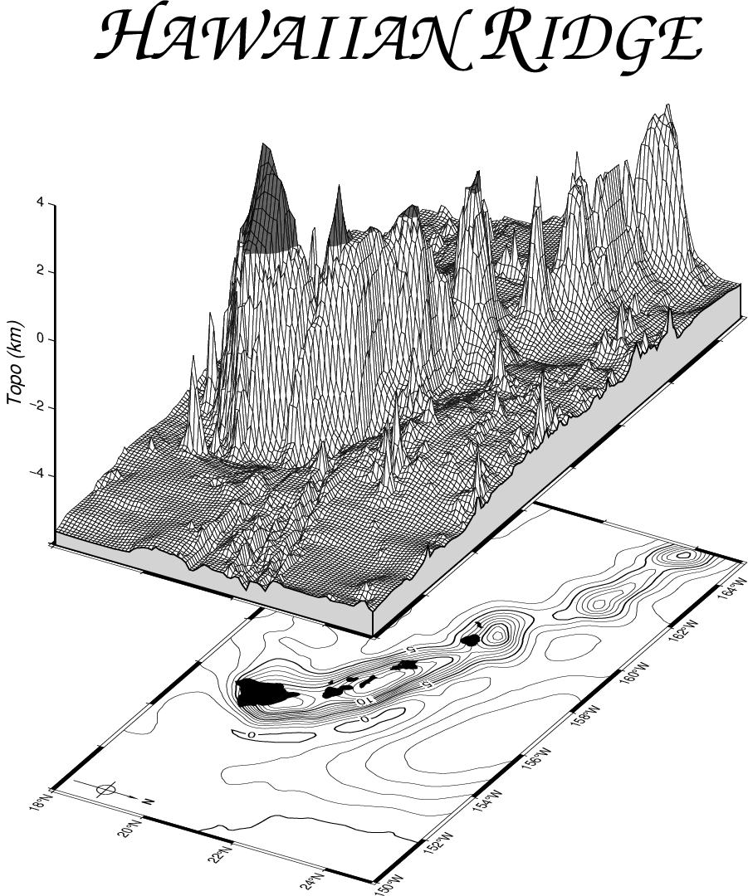{.card-img-top}](examples/images/index.html)
:::
:::

::: {.g-col-6 .g-col-md-4 .g-col-lg-3}
::: {.card .h-100}
[**Contours**](examples/contours/index.html){.card-title .stretched-link}
[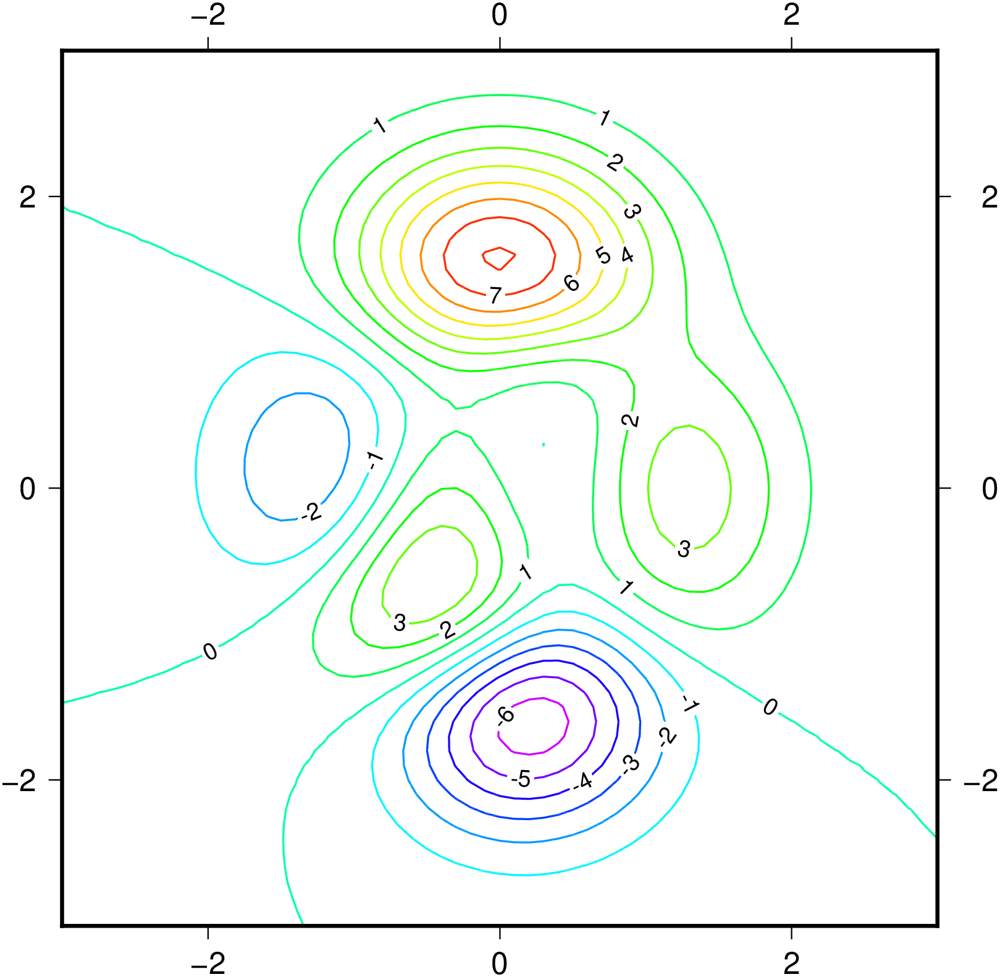{.card-img-top}](examples/contours/index.html)
:::
:::

::: {.g-col-6 .g-col-md-4 .g-col-lg-3}
::: {.card .h-100}
[**Arrows**](examples/arrows/index.html){.card-title .stretched-link}
[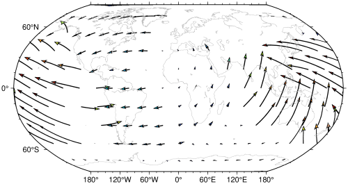{.card-img-top}](examples/arrows/index.html)
:::
:::

::: {.g-col-6 .g-col-md-4 .g-col-lg-3}
::: {.card .h-100}
[**Legends**](examples/legends/01_legends.qmd){.card-title .stretched-link}
[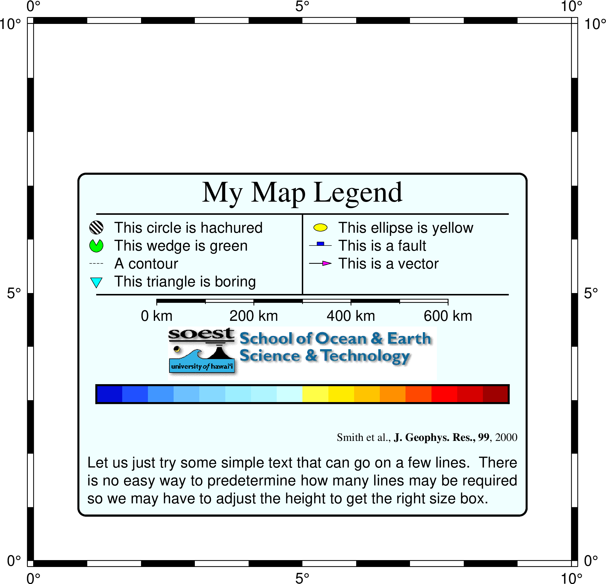{.card-img-top}](examples/legends/01_legends.qmd)
:::
:::

::: {.g-col-6 .g-col-md-4 .g-col-lg-3}
::: {.card .h-100}
[**Choropleth Maps**](examples/choropleths/choro_examples.qmd){.card-title .stretched-link}
[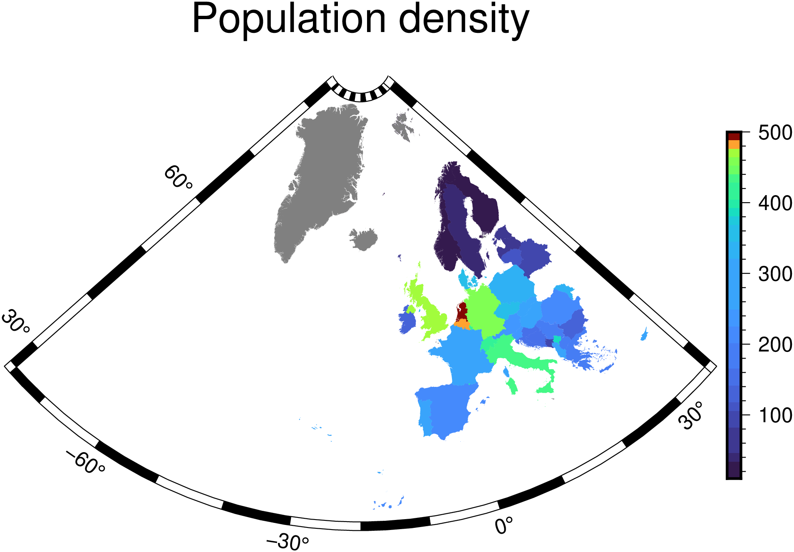{.card-img-top}](examples/choropleths/choro_examples.qmd)
:::
:::

::: {.g-col-6 .g-col-md-4 .g-col-lg-3}
::: {.card .h-100}
[**Ternary Plots**](examples/ternary/ternary_examples.qmd){.card-title .stretched-link}
[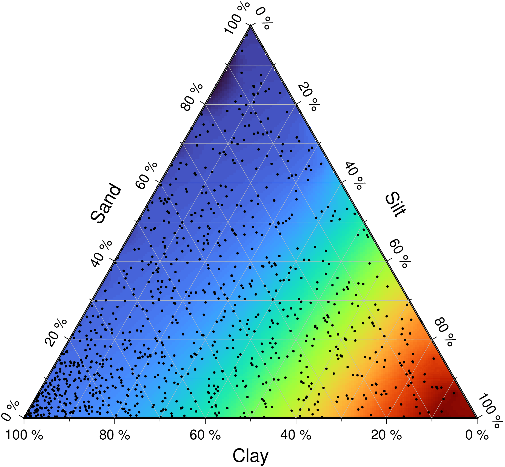{.card-img-top}](examples/ternary/ternary_examples.qmd)
:::
:::

::: {.g-col-6 .g-col-md-4 .g-col-lg-3}
::: {.card .h-100}
[**Subplots**](examples/subplot/01_subplots.qmd){.card-title .stretched-link}
[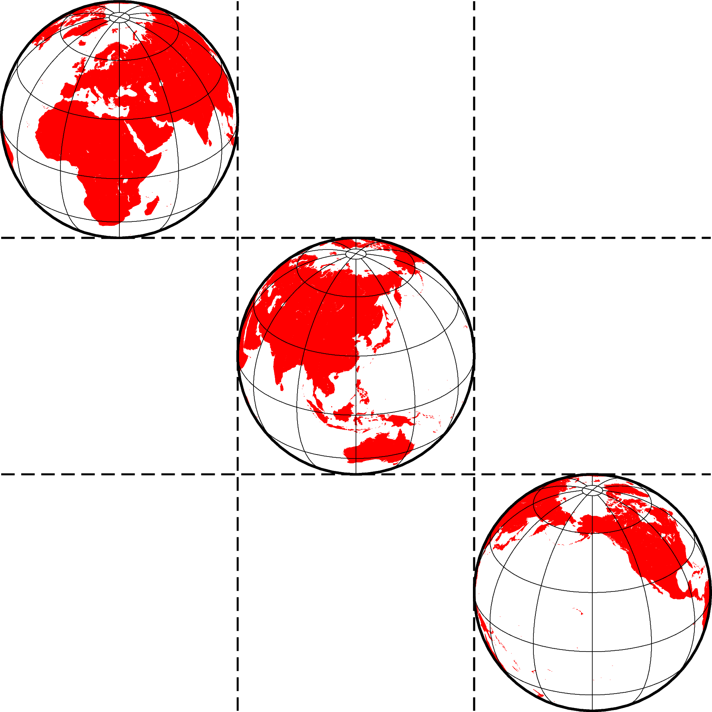{.card-img-top}](examples/subplot/01_subplots.qmd)
:::
:::

::: {.g-col-6 .g-col-md-4 .g-col-lg-3}
::: {.card .h-100}
[**Themes**](examples/themes/01_themes.qmd){.card-title .stretched-link}
[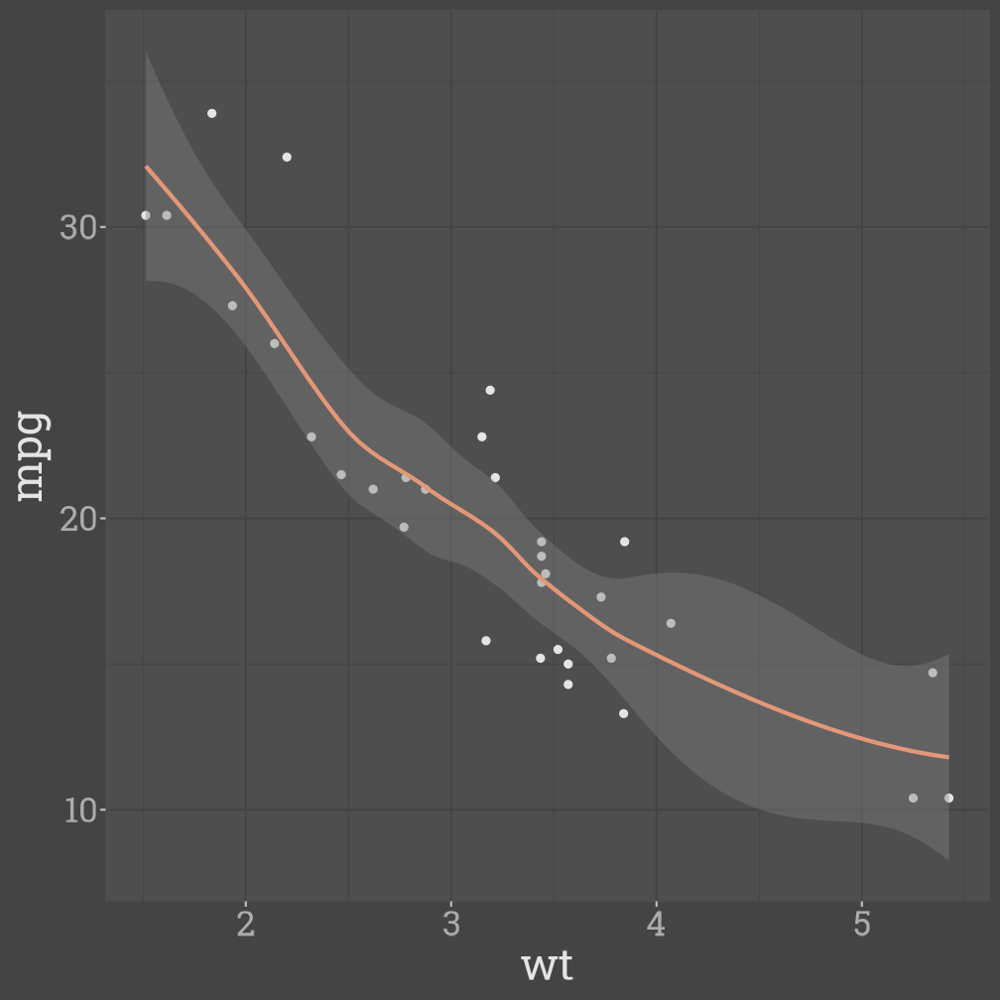{.card-img-top}](examples/themes/01_themes.qmd)
:::
:::

::: {.g-col-6 .g-col-md-4 .g-col-lg-3}
::: {.card .h-100}
[**Miscellaneous**](examples/misc/index.html){.card-title .stretched-link}
[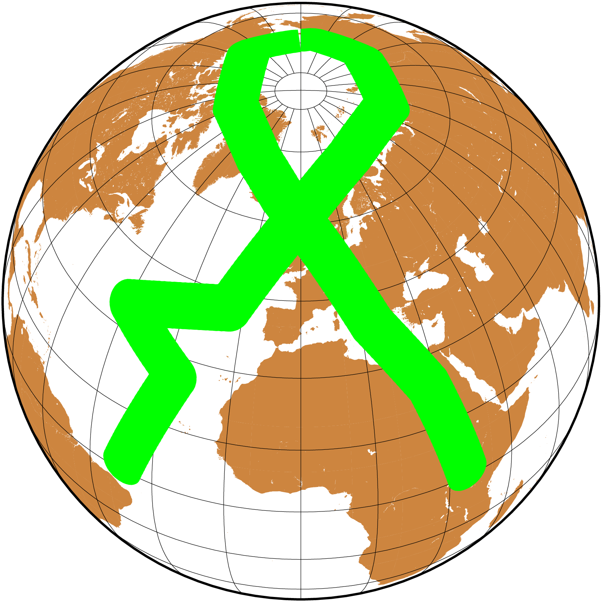{.card-img-top}](examples/misc/index.html)
:::
:::

::: {.g-col-6 .g-col-md-4 .g-col-lg-3}
::: {.card .h-100}
[**Embellishments**](examples/embellish/index.html){.card-title .stretched-link}
[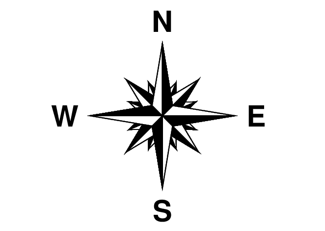{.card-img-top}](examples/embellish/index.html)
:::
:::

::: {.g-col-6 .g-col-md-4 .g-col-lg-3}
::: {.card .h-100}
[**Art**](examples/art/art_examples.qmd){.card-title .stretched-link}
[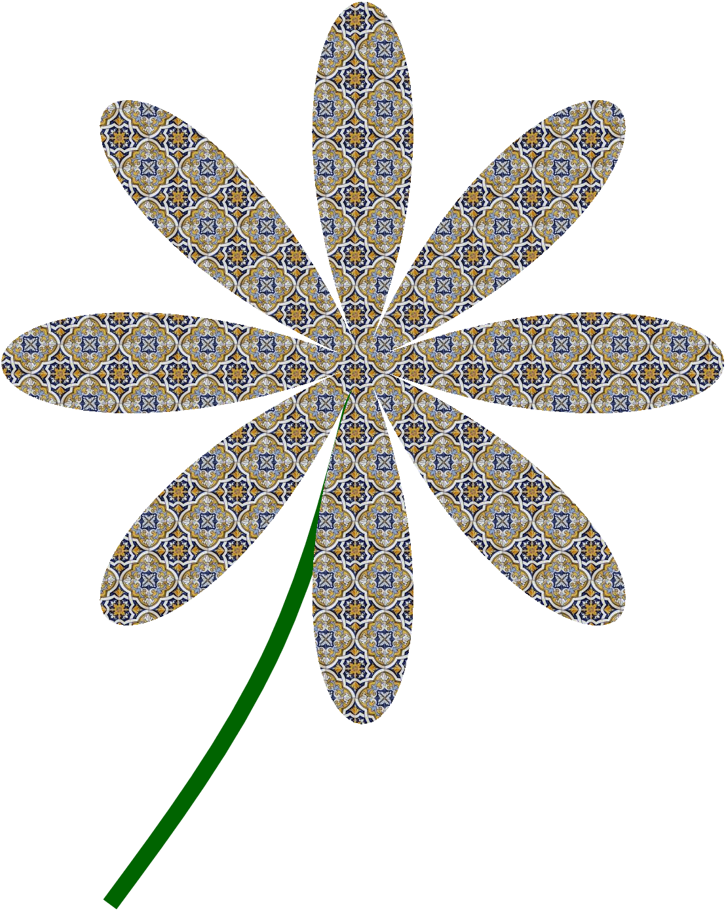{.card-img-top}](examples/art/art_examples.qmd)
:::
:::

:::
