

Complete reference documentation for all GMT plotting and processing modules.

---

::: {.grid}

::: {.g-col-6 .g-col-md-2 .g-col-lg-2}
::: {.card .h-100}
[**Core Programs**](#core-programs)
[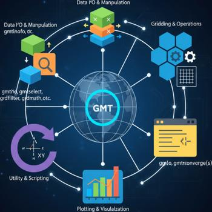{.card-img-top}](#core-programs)

::: {.card-body}
Core GMT programs.
:::
:::
:::

::: {.g-col-6 .g-col-md-2 .g-col-lg-2}
::: {.card .h-100}
[**Supplements**](#supplements)
[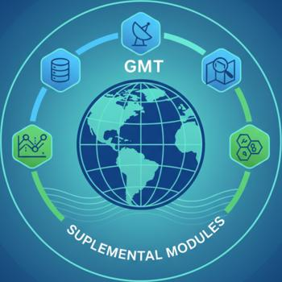{.card-img-top}](#supplements)

::: {.card-body}
Supplemental GMT programs.
:::
:::
:::

::: {.g-col-6 .g-col-md-2 .g-col-lg-2}
::: {.card .h-100}
[GMT.jl Extensions](extensions.qmd)
[{.card-img-top}](extensions.qmd)

::: {.card-body}
Additional plotting functions and data access utilities that extend GMT's core capabilities
:::
:::
:::

::: {.g-col-6 .g-col-md-2 .g-col-lg-2}
::: {.card .h-100}
[**Plotting**](#plotting-programs)

[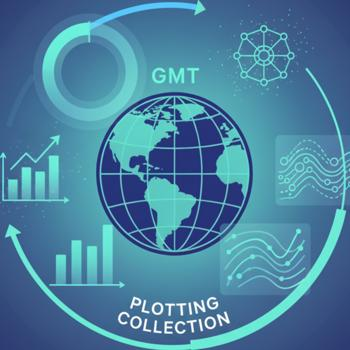{.card-img-top}](#plotting-programs)

::: {.card-body}
Plotting (GMT) programs
:::
:::
:::

::: {.g-col-6 .g-col-md-2 .g-col-lg-2}
::: {.card .h-100}
[**Grid operations**](#grid-operations)

[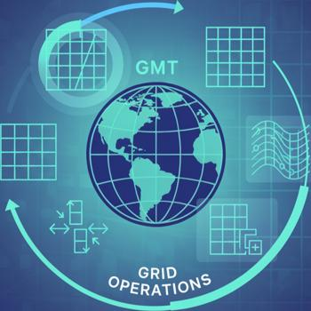{.card-img-top}](#grid-operations)

::: {.card-body}
Work with gridded datasets
:::
:::
:::

::: {.g-col-6 .g-col-md-2 .g-col-lg-2}
::: {.card .h-100}
[**Data Processing**](#data-processing)

[{.card-img-top}](#data-processing)

::: {.card-body}
Filter, transform, and analyze data
:::
:::
:::

:::

## Core Programs

::: {.grid}

::: {.g-col-6 .g-col-sm-6 .g-col-md-4 .g-col-lg-2}
::: {.card .h-100}
[**basemap**](modules/basemap.html)
[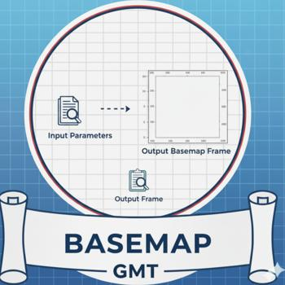{.card-img-top}](modules/basemap.html)

::: {.card-body}
Plot base maps and frames.
:::
:::
:::

::: {.g-col-6 .g-col-sm-6 .g-col-md-4 .g-col-lg-2}
::: {.card .h-100}
[blockmean](modules/blockmean.html)
[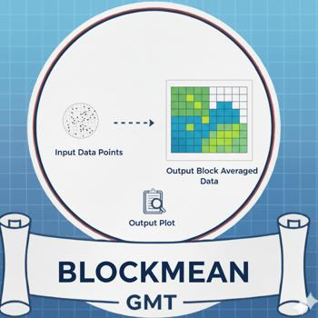{.card-img-top}](modules/blockmean.html)

::: {.card-body}
Block average (x,y,z) data tables by mean estimation.
:::
:::
:::

::: {.g-col-6 .g-col-sm-6 .g-col-md-4 .g-col-lg-2}
::: {.card .h-100}
[blockmedian](modules/blockmedian.html)

[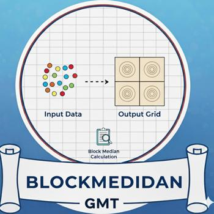{.card-img-top}](modules/blockmedian.html)

::: {.card-body}
Block average (x,y,z) data tables by median estimation
:::
:::
:::

::: {.g-col-6 .g-col-sm-6 .g-col-md-4 .g-col-lg-2}
::: {.card .h-100}
[blockmode](modules/blockmode.html)

[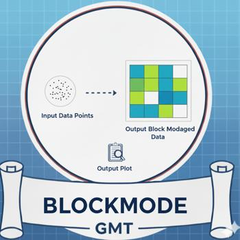{.card-img-top}](modules/blockmode.html)

::: {.card-body}
Block average (x,y,z) data tables by mode estimation
:::
:::
:::

::: {.g-col-6 .g-col-sm-6 .g-col-md-4 .g-col-lg-2}
::: {.card .h-100}
[clip](modules/clip.html)

[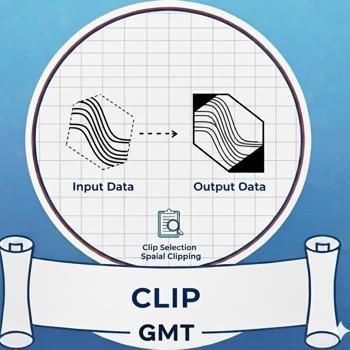{.card-img-top}](modules/clip.html)

::: {.card-body}
Initialize or terminate polygonal clip paths
:::
:::
:::

::: {.g-col-6 .g-col-sm-6 .g-col-md-4 .g-col-lg-2}
::: {.card .h-100}
[coast](modules/coast.html)

[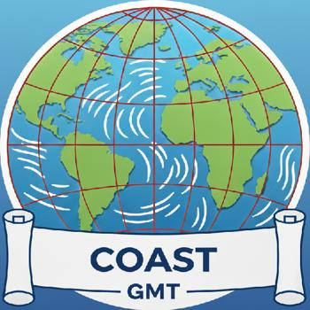{.card-img-top}](modules/coast.html)

::: {.card-body}
Plot continents, countries, shorelines, rivers, and borders
:::
:::
:::

::: {.g-col-6 .g-col-sm-6 .g-col-md-4 .g-col-lg-2}
::: {.card .h-100}
[colorbar](modules/colorbar.html)

[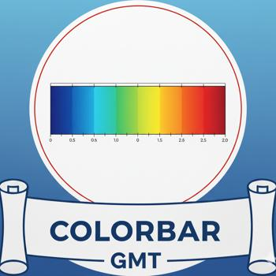{.card-img-top}](modules/colorbar.html)

::: {.card-body}
Plot gray scale or color scale bar
:::
:::
:::

::: {.g-col-6 .g-col-sm-6 .g-col-md-4 .g-col-lg-2}
::: {.card .h-100}
[contour](modules/contour.html)

[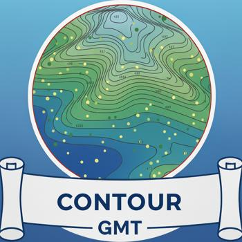{.card-img-top}](modules/contour.html)

::: {.card-body}
Contour table data by triangulation
:::
:::
:::

::: {.g-col-6 .g-col-sm-6 .g-col-md-4 .g-col-lg-2}
::: {.card .h-100}
[dimfilter](modules/dimfilter.html)

[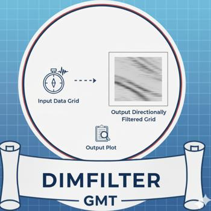{.card-img-top}](modules/dimfilter.html)

::: {.card-body}
Directional filtering of grids in the space domain
:::
:::
:::

::: {.g-col-6 .g-col-sm-6 .g-col-md-4 .g-col-lg-2}
::: {.card .h-100}
[events](modules/events.html)

[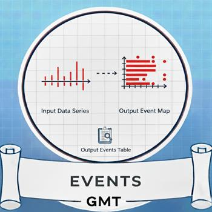{.card-img-top}](modules/events.html)

::: {.card-body}
Plot event symbols, lines, polygons and labels for one moment in time
:::
:::
:::

::: {.g-col-6 .g-col-sm-6 .g-col-md-4 .g-col-lg-2}
::: {.card .h-100}
[filter1d](modules/filter1d.html)

[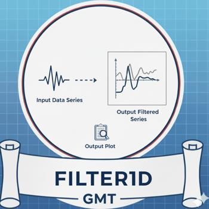{.card-img-top}](modules/filter1d.html)

::: {.card-body}
Time domain filtering of 1-D data tables
:::
:::
:::

::: {.g-col-6 .g-col-sm-6 .g-col-md-4 .g-col-lg-2}
::: {.card .h-100}
[fitcircle](modules/fitcircle.html)

[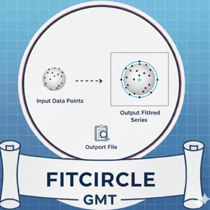{.card-img-top}](modules/fitcircle.html)

::: {.card-body}
Find mean position and best-fit great or small circle
:::
:::
:::

::: {.g-col-6 .g-col-sm-6 .g-col-md-4 .g-col-lg-2}
::: {.card .h-100}
[gmt2kml](modules/gmt2kml.html)

[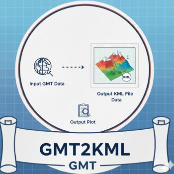{.card-img-top}](modules/gmt2kml.html)

::: {.card-body}
Convert tables to KML files for Google Earth
:::
:::
:::

::: {.g-col-6 .g-col-sm-6 .g-col-md-4 .g-col-lg-2}
::: {.card .h-100}
[gmtbinstats](modules/gmtbinstats.html)

[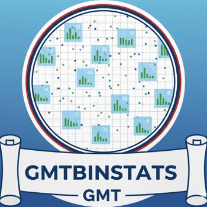{.card-img-top}](modules/gmtbinstats.html)

::: {.card-body}
Bin spatial data and compute various statistics
:::
:::
:::

::: {.g-col-6 .g-col-sm-6 .g-col-md-4 .g-col-lg-2}
::: {.card .h-100}
[gmtconnect](modules/gmtconnect.html)

[{.card-img-top}](modules/gmtconnect.html)

::: {.card-body}
Connect individual lines whose end points match
:::
:::
:::

::: {.g-col-6 .g-col-sm-6 .g-col-md-4 .g-col-lg-2}
::: {.card .h-100}
[gmtconvert](modules/gmtconvert.html)

[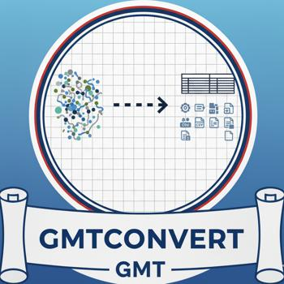{.card-img-top}](modules/gmtconvert.html)

::: {.card-body}
Convert, paste, or extract columns from tables
:::
:::
:::

::: {.g-col-6 .g-col-sm-6 .g-col-md-4 .g-col-lg-2}
::: {.card .h-100}
[gmtdefaults](modules/gmtdefaults.html)

[{.card-img-top}](modules/gmtdefaults.html)

::: {.card-body}
List current GMT default settings
:::
:::
:::

::: {.g-col-6 .g-col-sm-6 .g-col-md-4 .g-col-lg-2}
::: {.card .h-100}
[gmtinfo](modules/gmtinfo.html)

[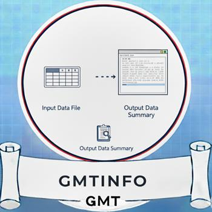{.card-img-top}](modules/gmtinfo.html)

::: {.card-body}
Get information about data tables
:::
:::
:::

::: {.g-col-6 .g-col-sm-6 .g-col-md-4 .g-col-lg-2}
::: {.card .h-100}
[gmtlogo](modules/gmtlogo.html)

[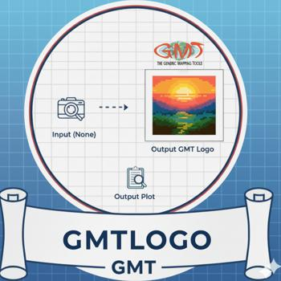{.card-img-top}](modules/gmtlogo.html)

::: {.card-body}
Plot the GMT & Julia logos
:::
:::
:::

::: {.g-col-6 .g-col-sm-6 .g-col-md-4 .g-col-lg-2}
::: {.card .h-100}
[gmtmath](modules/gmtmath.html)

[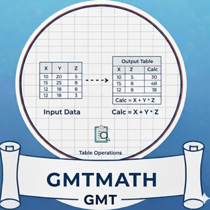{.card-img-top}](modules/gmtmath.html)

::: {.card-body}
Reverse Polish Notation calculator for data tables
:::
:::
:::

::: {.g-col-6 .g-col-sm-6 .g-col-md-4 .g-col-lg-2}
::: {.card .h-100}
[gmtregress](modules/gmtregress.html)

[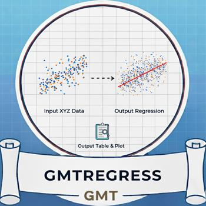{.card-img-top}](modules/gmtregress.html)

::: {.card-body}
Linear regression of 1-D data sets
:::
:::
:::

::: {.g-col-6 .g-col-sm-6 .g-col-md-4 .g-col-lg-2}
::: {.card .h-100}
[gmtselect](modules/gmtselect.html)

[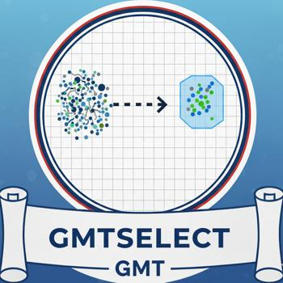{.card-img-top}](modules/gmtselect.html)

::: {.card-body}
Select data table subsets based on multiple spatial criteria
:::
:::
:::

::: {.g-col-6 .g-col-sm-6 .g-col-md-4 .g-col-lg-2}
::: {.card .h-100}
[gmtset](modules/gmtset.html)

[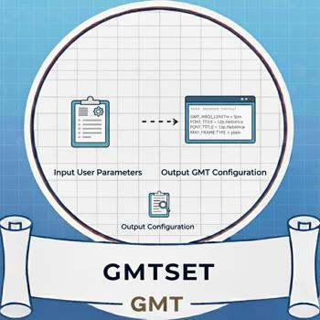{.card-img-top}](modules/gmtset.html)

::: {.card-body}
Change individual GMT default parameters
:::
:::
:::

::: {.g-col-6 .g-col-sm-6 .g-col-md-4 .g-col-lg-2}
::: {.card .h-100}
[gmtsimplify](modules/gmtsimplify.html)

[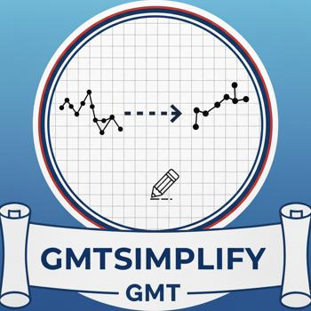{.card-img-top}](modules/gmtsimplify.html)

::: {.card-body}
Line reduction using the Douglas-Peucker algorithm
:::
:::
:::

::: {.g-col-6 .g-col-sm-6 .g-col-md-4 .g-col-lg-2}
::: {.card .h-100}
[gmtspatial](modules/gmtspatial.html)

[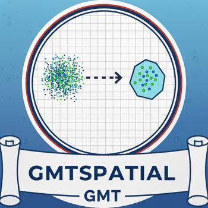{.card-img-top}](modules/gmtspatial.html)

::: {.card-body}
Geospatial operations on points, lines and polygons
:::
:::
:::

::: {.g-col-6 .g-col-sm-6 .g-col-md-4 .g-col-lg-2}
::: {.card .h-100}
[gmtsplit](modules/gmtsplit.html)

[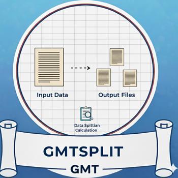{.card-img-top}](modules/gmtsplit.html)

::: {.card-body}
Split xyz[dh] data tables into individual segments
:::
:::
:::

::: {.g-col-6 .g-col-sm-6 .g-col-md-4 .g-col-lg-2}
::: {.card .h-100}
[gmtwhich](modules/gmtwhich.html)

[{.card-img-top}](modules/gmtwhich.html)

::: {.card-body}
Find full path to specified files
:::
:::
:::

::: {.g-col-6 .g-col-sm-6 .g-col-md-4 .g-col-lg-2}
::: {.card .h-100}
[grd2cpt](modules/grd2cpt.html)

[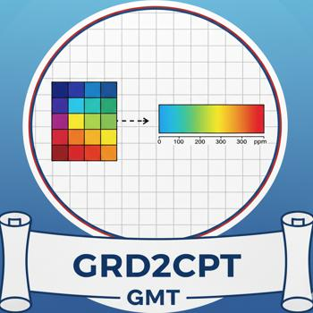{.card-img-top}](modules/grd2cpt.html)

::: {.card-body}
Make linear or histogram-equalized color palette from grid
:::
:::
:::

::: {.g-col-6 .g-col-sm-6 .g-col-md-4 .g-col-lg-2}
::: {.card .h-100}
[grd2kml](modules/grd2kml.html)

[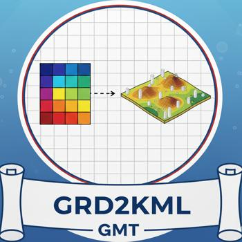{.card-img-top}](modules/grd2kml.html)

::: {.card-body}
Create KML image quadtree from single grid
:::
:::
:::

::: {.g-col-6 .g-col-sm-6 .g-col-md-4 .g-col-lg-2}
::: {.card .h-100}
[grd2xyz](modules/grd2xyz.html)

[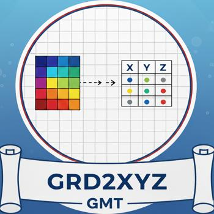{.card-img-top}](modules/grd2xyz.html)

::: {.card-body}
Convert grid to data table
:::
:::
:::

::: {.g-col-6 .g-col-sm-6 .g-col-md-4 .g-col-lg-2}
::: {.card .h-100}
[grdclip](modules/grdclip.html)

[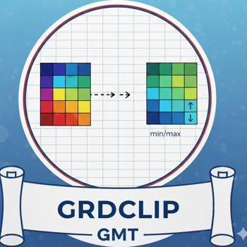{.card-img-top}](modules/grdclip.html)

::: {.card-body}
Clip the range of grid values
:::
:::
:::

::: {.g-col-6 .g-col-sm-6 .g-col-md-4 .g-col-lg-2}
::: {.card .h-100}
[grdcontour](modules/grdcontour.html)

[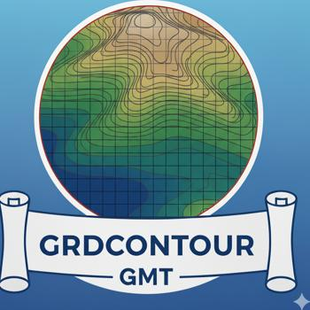{.card-img-top}](modules/grdcontour.html)

::: {.card-body}
Make contour map using a grid
:::
:::
:::

::: {.g-col-6 .g-col-sm-6 .g-col-md-4 .g-col-lg-2}
::: {.card .h-100}
[grdcut](modules/grdcut.html)

[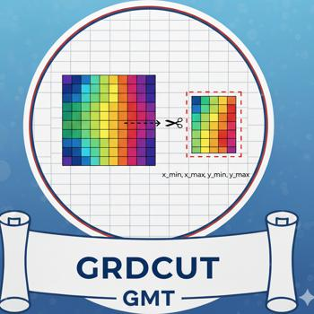{.card-img-top}](modules/grdcut.html)

::: {.card-body}
Extract subregion from a grid
:::
:::
:::

::: {.g-col-6 .g-col-sm-6 .g-col-md-4 .g-col-lg-2}
::: {.card .h-100}
[grdedit](modules/grdedit.html)

[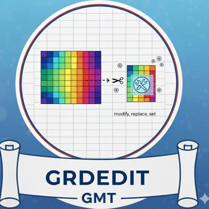{.card-img-top}](modules/grdedit.html)

::: {.card-body}
Modify header or content of a grid
:::
:::
:::

::: {.g-col-6 .g-col-sm-6 .g-col-md-4 .g-col-lg-2}
::: {.card .h-100}
[grdfft](modules/grdfft.html)

[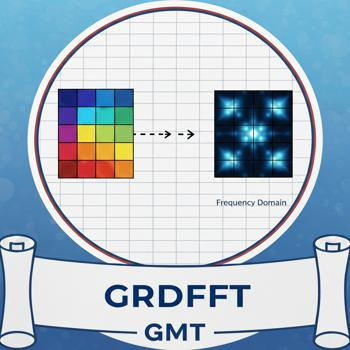{.card-img-top}](modules/grdfft.html)

::: {.card-body}
Mathematical operations on grids in the spectral domain
:::
:::
:::

::: {.g-col-6 .g-col-sm-6 .g-col-md-4 .g-col-lg-2}
::: {.card .h-100}
[grdfill](modules/grdfill.html)

[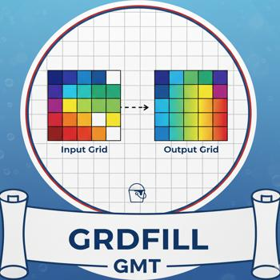{.card-img-top}](modules/grdfill.html)

::: {.card-body}
Fill blank areas in grids
:::
:::
:::

::: {.g-col-6 .g-col-sm-6 .g-col-md-4 .g-col-lg-2}
::: {.card .h-100}
[grdfilter](modules/grdfilter.html)

[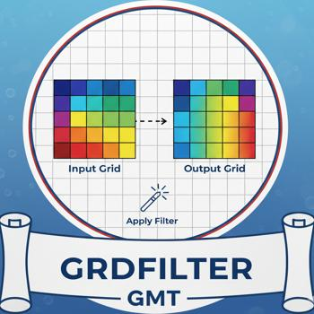{.card-img-top}](modules/grdfilter.html)

::: {.card-body}
Filter a grid in the space or time domain
:::
:::
:::

::: {.g-col-6 .g-col-sm-6 .g-col-md-4 .g-col-lg-2}
::: {.card .h-100}
[grdgradient](modules/grdgradient.html)

[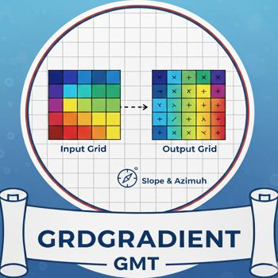{.card-img-top}](modules/grdgradient.html)

::: {.card-body}
Compute directional gradients from a grid
:::
:::
:::

::: {.g-col-6 .g-col-sm-6 .g-col-md-4 .g-col-lg-2}
::: {.card .h-100}
[grdhisteq](modules/grdhisteq.html)

[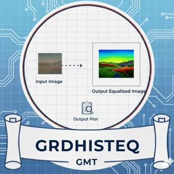{.card-img-top}](modules/grdhisteq.html)

::: {.card-body}
Perform histogram equalization for a grid
:::
:::
:::

::: {.g-col-6 .g-col-sm-6 .g-col-md-4 .g-col-lg-2}
::: {.card .h-100}
[grdimage](modules/grdimage.html)

[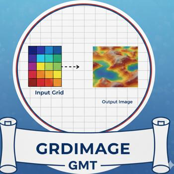{.card-img-top}](modules/grdimage.html)

::: {.card-body}
Project and plot grids or images
:::
:::
:::

::: {.g-col-6 .g-col-sm-6 .g-col-md-4 .g-col-lg-2}
::: {.card .h-100}
[grdinfo](modules/grdinfo.html)

[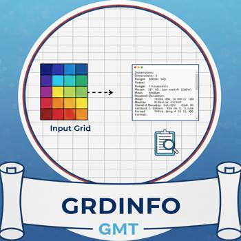{.card-img-top}](modules/grdinfo.html)

::: {.card-body}
Extract information from grids
:::
:::
:::

::: {.g-col-6 .g-col-sm-6 .g-col-md-4 .g-col-lg-2}
::: {.card .h-100}
[grdlandmask](modules/grdlandmask.html)

[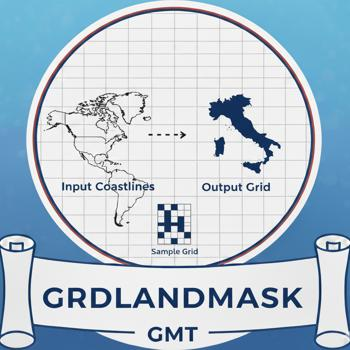{.card-img-top}](modules/grdlandmask.html)

::: {.card-body}
Create "wet-dry" mask grid from shoreline data base
:::
:::
:::

::: {.g-col-6 .g-col-sm-6 .g-col-md-4 .g-col-lg-2}
::: {.card .h-100}
[grdmask](modules/grdmask.html)

[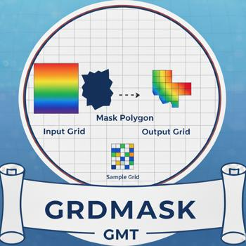{.card-img-top}](modules/grdmask.html)

::: {.card-body}
Create mask grid from polygons or point coverage
:::
:::
:::

::: {.g-col-6 .g-col-sm-6 .g-col-md-4 .g-col-lg-2}
::: {.card .h-100}
[grdmath](modules/grdmath.html)

[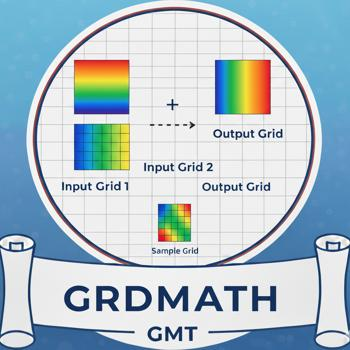{.card-img-top}](modules/grdmath.html)

::: {.card-body}
Reverse Polish Notation calculator for grids
:::
:::
:::

::: {.g-col-6 .g-col-sm-6 .g-col-md-4 .g-col-lg-2}
::: {.card .h-100}
[grdpaste](modules/grdpaste.html)

[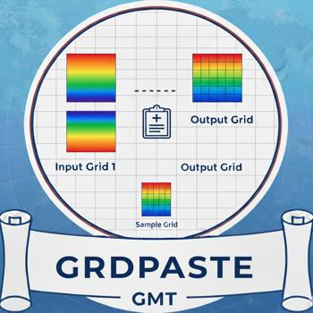{.card-img-top}](modules/grdpaste.html)

::: {.card-body}
Join two grids along their common edge
:::
:::
:::

::: {.g-col-6 .g-col-sm-6 .g-col-md-4 .g-col-lg-2}
::: {.card .h-100}
[grdproject](modules/grdproject.html)

[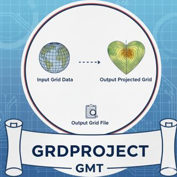{.card-img-top}](modules/grdproject.html)

::: {.card-body}
Forward and inverse map transformation of grids
:::
:::
:::

::: {.g-col-6 .g-col-sm-6 .g-col-md-4 .g-col-lg-2}
::: {.card .h-100}
[grdsample](modules/grdsample.html)

[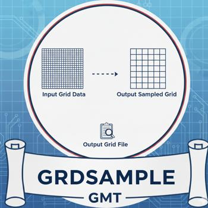{.card-img-top}](modules/grdsample.html)

::: {.card-body}
Resample a grid onto a new lattice
:::
:::
:::

::: {.g-col-6 .g-col-sm-6 .g-col-md-4 .g-col-lg-2}
::: {.card .h-100}
[grdtrack](modules/grdtrack.html)

[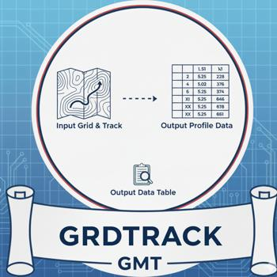{.card-img-top}](modules/grdtrack.html)

::: {.card-body}
Sample grids at specified (x,y) locations
:::
:::
:::

::: {.g-col-6 .g-col-sm-6 .g-col-md-4 .g-col-lg-2}
::: {.card .h-100}
[grdtrend](modules/grdtrend.html)

[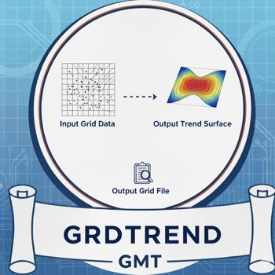{.card-img-top}](modules/grdtrend.html)

::: {.card-body}
Fit trend surface to grids and compute residuals
:::
:::
:::

::: {.g-col-6 .g-col-sm-6 .g-col-md-4 .g-col-lg-2}
::: {.card .h-100}
[grdvector](modules/grdvector.html)

[{.card-img-top}](modules/grdvector.html)

::: {.card-body}
Plot vector field from two component grids
:::
:::
:::

::: {.g-col-6 .g-col-sm-6 .g-col-md-4 .g-col-lg-2}
::: {.card .h-100}
[grdview](modules/grdview.html)

[{.card-img-top}](modules/grdview.html)

::: {.card-body}
Create 3-D perspective image or surface mesh from a grid
:::
:::
:::

::: {.g-col-6 .g-col-sm-6 .g-col-md-4 .g-col-lg-2}
::: {.card .h-100}
[grdvolume](modules/grdvolume.html)

[{.card-img-top}](modules/grdvolume.html)

::: {.card-body}
Calculate grid volume and area constrained by a contour
:::
:::
:::

::: {.g-col-6 .g-col-sm-6 .g-col-md-4 .g-col-lg-2}
::: {.card .h-100}
[greenspline](modules/greenspline.html)

[{.card-img-top}](modules/greenspline.html)

::: {.card-body}
Interpolate using Green's functions for splines
:::
:::
:::

::: {.g-col-6 .g-col-sm-6 .g-col-md-4 .g-col-lg-2}
::: {.card .h-100}
[histogram](modules/histogram.html)

[{.card-img-top}](modules/histogram.html)

::: {.card-body}
Plot a histogram
:::
:::
:::

::: {.g-col-6 .g-col-sm-6 .g-col-md-4 .g-col-lg-2}
::: {.card .h-100}
[image](modules/image.html)

[{.card-img-top}](modules/image.html)

::: {.card-body}
Plot raster or EPS images
:::
:::
:::

::: {.g-col-6 .g-col-sm-6 .g-col-md-4 .g-col-lg-2}
::: {.card .h-100}
[inset](modules/inset.html)

[{.card-img-top}](modules/inset.html)

::: {.card-body}
Manage figure inset setup and completion
:::
:::
:::

::: {.g-col-6 .g-col-sm-6 .g-col-md-4 .g-col-lg-2}
::: {.card .h-100}
[kml2gmt](modules/kml2gmt.html)

[{.card-img-top}](modules/kml2gmt.html)

::: {.card-body}
Extract GMT table data from Google Earth KML files
:::
:::
:::

::: {.g-col-6 .g-col-sm-6 .g-col-md-4 .g-col-lg-2}
::: {.card .h-100}
[legend](modules/legend.html)

[{.card-img-top}](modules/legend.html)

::: {.card-body}
Plot a legend
:::
:::
:::

::: {.g-col-6 .g-col-sm-6 .g-col-md-4 .g-col-lg-2}
::: {.card .h-100}
[makecpt](modules/makecpt.html)

[{.card-img-top}](modules/makecpt.html)

::: {.card-body}
Make GMT color palette tables
:::
:::
:::

::: {.g-col-6 .g-col-sm-6 .g-col-md-4 .g-col-lg-2}
::: {.card .h-100}
[mapproject](modules/mapproject.html)

[{.card-img-top}](modules/mapproject.html)

::: {.card-body}
Forward and inverse map transformations of 2-D coordinates
:::
:::
:::

::: {.g-col-6 .g-col-sm-6 .g-col-md-4 .g-col-lg-2}
::: {.card .h-100}
[mask](modules/mask.html)

[{.card-img-top}](modules/mask.html)

::: {.card-body}
Clip or mask map areas with no data coverage
:::
:::
:::

::: {.g-col-6 .g-col-sm-6 .g-col-md-4 .g-col-lg-2}
::: {.card .h-100}
[movie](modules/movie.html)

[{.card-img-top}](modules/movie.html)

::: {.card-body}
Create animation sequences and movies
:::
:::
:::

::: {.g-col-6 .g-col-sm-6 .g-col-md-4 .g-col-lg-2}
::: {.card .h-100}
[nearneighbor](modules/nearneighbor.html)

[{.card-img-top}](modules/nearneighbor.html)

::: {.card-body}
Grid table data using a "Nearest neighbor" algorithm
:::
:::
:::

::: {.g-col-6 .g-col-sm-6 .g-col-md-4 .g-col-lg-2}
::: {.card .h-100}
[plot](modules/plot.html)

[{.card-img-top}](modules/plot.html)

::: {.card-body}
Plot lines, polygons, and symbols
:::
:::
:::

::: {.g-col-6 .g-col-sm-6 .g-col-md-4 .g-col-lg-2}
::: {.card .h-100}
[plot3d](modules/plot3d.html)

[{.card-img-top}](modules/plot3d.html)

::: {.card-body}
Plot lines, polygons, and symbols in 3-D
:::
:::
:::

::: {.g-col-6 .g-col-sm-6 .g-col-md-4 .g-col-lg-2}
::: {.card .h-100}
[project](modules/project.html)

[{.card-img-top}](modules/project.html)

::: {.card-body}
Project data onto lines or great circles
:::
:::
:::

::: {.g-col-6 .g-col-sm-6 .g-col-md-4 .g-col-lg-2}
::: {.card .h-100}
[rose](modules/rose.html)

[{.card-img-top}](modules/rose.html)

::: {.card-body}
Plot a polar histogram (rose diagram)
:::
:::
:::

::: {.g-col-6 .g-col-sm-6 .g-col-md-4 .g-col-lg-2}
::: {.card .h-100}
[sample1d](modules/sample1d.html)

[{.card-img-top}](modules/sample1d.html)

::: {.card-body}
Resample 1-D table data using splines
:::
:::
:::

::: {.g-col-6 .g-col-sm-6 .g-col-md-4 .g-col-lg-2}
::: {.card .h-100}
[solar](modules/solar.html)

[{.card-img-top}](modules/solar.html)

::: {.card-body}
Plot day-light terminators and other sunlight parameters
:::
:::
:::

::: {.g-col-6 .g-col-sm-6 .g-col-md-4 .g-col-lg-2}
::: {.card .h-100}
[spectrum1d](modules/spectrum1d.html)

[{.card-img-top}](modules/spectrum1d.html)

::: {.card-body}
Compute auto- and cross-spectra from one or two time series
:::
:::
:::

::: {.g-col-6 .g-col-sm-6 .g-col-md-4 .g-col-lg-2}
::: {.card .h-100}
[sph2grd](modules/sph2grd.html)

[{.card-img-top}](modules/sph2grd.html)

::: {.card-body}
Compute grid from spherical harmonic coefficients
:::
:::
:::

::: {.g-col-6 .g-col-sm-6 .g-col-md-4 .g-col-lg-2}
::: {.card .h-100}
[sphdistance](modules/sphdistance.html)

[{.card-img-top}](modules/sphdistance.html)

::: {.card-body}
Create Voronoi distance, node, or natural nearest-neighbor grid on a sphere
:::
:::
:::

::: {.g-col-6 .g-col-sm-6 .g-col-md-4 .g-col-lg-2}
::: {.card .h-100}
[sphinterpolate](modules/sphinterpolate.html)

[{.card-img-top}](modules/sphinterpolate.html)

::: {.card-body}
Spherical gridding in tension of data on a sphere
:::
:::
:::

::: {.g-col-6 .g-col-sm-6 .g-col-md-4 .g-col-lg-2}
::: {.card .h-100}
[sphtriangulate](modules/sphtriangulate.html)

[{.card-img-top}](modules/sphtriangulate.html)

::: {.card-body}
Delaunay or Voronoi construction of spherical data
:::
:::
:::

::: {.g-col-6 .g-col-sm-6 .g-col-md-4 .g-col-lg-2}
::: {.card .h-100}
[splitxyz](modules/splitxyz.html)

[{.card-img-top}](modules/splitxyz.html)

::: {.card-body}
Split xyz[dh] data tables into individual segments
:::
:::
:::

::: {.g-col-6 .g-col-sm-6 .g-col-md-4 .g-col-lg-2}
::: {.card .h-100}
[subplot](modules/subplot.html)

[{.card-img-top}](modules/subplot.html)

::: {.card-body}
Manage modern mode figure subplot configuration and selection
:::
:::
:::

::: {.g-col-6 .g-col-sm-6 .g-col-md-4 .g-col-lg-2}
::: {.card .h-100}
[surface](modules/surface.html)

[{.card-img-top}](modules/surface.html)

::: {.card-body}
Grid table data using adjustable tension continuous curvature splines
:::
:::
:::

::: {.g-col-6 .g-col-sm-6 .g-col-md-4 .g-col-lg-2}
::: {.card .h-100}
[ternary](modules/ternary.html)

[{.card-img-top}](modules/ternary.html)

::: {.card-body}
Plot data on ternary diagrams
:::
:::
:::

::: {.g-col-6 .g-col-sm-6 .g-col-md-4 .g-col-lg-2}
::: {.card .h-100}
[text](modules/text.html)

[{.card-img-top}](modules/text.html)

::: {.card-body}
Plot or typeset text
:::
:::
:::

::: {.g-col-6 .g-col-sm-6 .g-col-md-4 .g-col-lg-2}
::: {.card .h-100}
[trend1d](modules/trend1d.html)

[{.card-img-top}](modules/trend1d.html)

::: {.card-body}
Fit a polynomial trend to time series
:::
:::
:::

::: {.g-col-6 .g-col-sm-6 .g-col-md-4 .g-col-lg-2}
::: {.card .h-100}
[trend2d](modules/trend2d.html)

[{.card-img-top}](modules/trend2d.html)

::: {.card-body}
Fit a polynomial trend to grids
:::
:::
:::

::: {.g-col-6 .g-col-sm-6 .g-col-md-4 .g-col-lg-2}
::: {.card .h-100}
[triangulate](modules/triangulate.html)

[{.card-img-top}](modules/triangulate.html)

::: {.card-body}
Delaunay triangulation or Voronoi partitioning and gridding
:::
:::
:::

::: {.g-col-6 .g-col-sm-6 .g-col-md-4 .g-col-lg-2}
::: {.card .h-100}
[wiggle](modules/wiggle.html)

[{.card-img-top}](modules/wiggle.html)

::: {.card-body}
Plot z = f(x,y) anomalies along tracks
:::
:::
:::

::: {.g-col-6 .g-col-sm-6 .g-col-md-4 .g-col-lg-2}
::: {.card .h-100}
[xyz2grd](modules/xyz2grd.html)

[{.card-img-top}](modules/xyz2grd.html)

::: {.card-body}
Convert data table to a grid
:::
:::
:::

:::

## Supplements

::: {.grid}

::: {.g-col-6 .g-col-sm-6 .g-col-md-4 .g-col-lg-2}
::: {.card .h-100}
[earthtide](modules/earthtide.html)

[{.card-img-top}](modules/earthtide.html)

::: {.card-body}
Compute grids or time-series of solid Earth tides
:::
:::
:::

::: {.g-col-6 .g-col-sm-6 .g-col-md-4 .g-col-lg-2}
::: {.card .h-100}
[img2grd](modules/img2grd.html)
[{.card-img-top style="opacity: 0.25;"}](modules/img2grd.html)

::: {.card-body}
Extract a subset from an img file in Mercator or Geographic format
:::
:::
:::

::: {.g-col-6 .g-col-sm-6 .g-col-md-4 .g-col-lg-2}
::: {.card .h-100}
[flexure](modules/flexure.html)
[{.card-img-top style="opacity: 0.25;"}](modules/flexure.html)

::: {.card-body}
Compute flexural deformation of 2-D loads, forces, and bending moments.
:::
:::
:::

::: {.g-col-6 .g-col-sm-6 .g-col-md-4 .g-col-lg-2}
::: {.card .h-100}
[segy2grd](modules/segy2grd.html)
[{.card-img-top"}](modules/segy2grd.html)

::: {.card-body}
Converting SEGY data to a grid.
:::
:::
:::

::: {.g-col-6 .g-col-sm-6 .g-col-md-4 .g-col-lg-2}
::: {.card .h-100}
[grdrotater](modules/grdrotater.html)
[{.card-img-top style="opacity: 0.25;"}](modules/grdrotater.html)

::: {.card-body}
Finite rotation reconstruction of geographic grid.
:::
:::
:::

::: {.g-col-6 .g-col-sm-6 .g-col-md-4 .g-col-lg-2}
::: {.card .h-100}
[gpsgridder](modules/gpsgridder.html)
[{.card-img-top style="opacity: 0.25;"}](modules/gpsgridder.html)

::: {.card-body}
Interpolate GPS velocities using Green’s functions for elastic deformation.
:::
:::
:::

::: {.g-col-6 .g-col-sm-6 .g-col-md-4 .g-col-lg-2}
::: {.card .h-100}
[mgd77convert](modules/mgd77convert.html)
[{.card-img-top style="opacity: 0.25;"}](modules/mgd77convert.html)

::: {.card-body}
Convert MGD77 data to other formats.
:::
:::
:::

::: {.g-col-6 .g-col-sm-6 .g-col-md-4 .g-col-lg-2}
::: {.card .h-100}
[gravfft](modules/gravfft.html)
[{.card-img-top}](modules/gravfft.html)

::: {.card-body}
Spectral calculations of gravity, isostasy, admittance, and coherence for grids.
:::
:::
:::

::: {.g-col-6 .g-col-sm-6 .g-col-md-4 .g-col-lg-2}
::: {.card .h-100}
[segy](modules/segy.html)
[{.card-img-top"}](modules/segy.html)

::: {.card-body}
Plot a SEGY file in 2-D.
:::
:::
:::

::: {.g-col-6 .g-col-sm-6 .g-col-md-4 .g-col-lg-2}
::: {.card .h-100}
[segyz](modules/segyz.html)
[{.card-img-top"}](modules/segyz.html)

::: {.card-body}
Plot a SEGY file in 3-D.
:::
:::
:::

::: {.g-col-6 .g-col-sm-6 .g-col-md-4 .g-col-lg-2}
::: {.card .h-100}
[grdspotter](modules/grdspotter.html)
[{.card-img-top style="opacity: 0.25;"}](modules/grdspotter.html)

::: {.card-body}
Create CVA grid from a gravity or topography grid.
:::
:::
:::

::: {.g-col-6 .g-col-sm-6 .g-col-md-4 .g-col-lg-2}
::: {.card .h-100}
[velo](modules/velo.html)
[{.card-img-top}](modules/velo.html)

::: {.card-body}
Plot velocity vectors, crosses, anisotropy bars and wedges.
:::
:::
:::

::: {.g-col-6 .g-col-sm-6 .g-col-md-4 .g-col-lg-2}
::: {.card .h-100}
[magref](modules/magref.html)
[{.card-img-top}](modules/magref.html)

::: {.card-body}
Evaluate the IGRF or CM4 magnetic field models.
:::
:::
:::

::: {.g-col-6 .g-col-sm-6 .g-col-md-4 .g-col-lg-2}
::: {.card .h-100}
[mgd77track](modules/mgd77track.html)
[{.card-img-top style="opacity: 0.25;"}](modules/mgd77track.html)

::: {.card-body}
Plot track-lines of MGD77 cruises.
:::
:::
:::

::: {.g-col-6 .g-col-sm-6 .g-col-md-4 .g-col-lg-2}
::: {.card .h-100}
[gravmag3d](modules/gravmag3d.html)
[{.card-img-top}](modules/gravmag3d.html)

::: {.card-body}
Compute the gravity/magnetic anomaly of a 3-D body by the method of Okabe.
:::
:::
:::

::: {.g-col-6 .g-col-sm-6 .g-col-md-4 .g-col-lg-2}
::: {.card .h-100}
[hotspotter](modules/hotspotter.html)
[{.card-img-top style="opacity: 0.25;"}](modules/hotspotter.html)

::: {.card-body}
Create CVA grid from seamount locations.
:::
:::
:::

::: {.g-col-6 .g-col-sm-6 .g-col-md-4 .g-col-lg-2}
::: {.card .h-100}
[gravprisms](modules/gravprisms.html)
[{.card-img-top}](modules/gravprisms.html)

::: {.card-body}
Compute geopotential anomalies over 3-D vertical prisms.
:::
:::
:::

::: {.g-col-6 .g-col-sm-6 .g-col-md-4 .g-col-lg-2}
::: {.card .h-100}
[coupe](modules/coupe.html)
[{.card-img-top}](modules/coupe.html)

::: {.card-body}
Plot cross-sections of focal mechanisms.
:::
:::
:::

::: {.g-col-6 .g-col-sm-6 .g-col-md-4 .g-col-lg-2}
::: {.card .h-100}
[originater](modules/originater.html)
[{.card-img-top style="opacity: 0.25;"}](modules/originater.html)

::: {.card-body}
Associate seamounts with nearest hotspot point sources.
:::
:::
:::

::: {.g-col-6 .g-col-sm-6 .g-col-md-4 .g-col-lg-2}
::: {.card .h-100}
[grdflexure](modules/grdflexure.html)
[{.card-img-top style="opacity: 0.25;"}](modules/grdflexure.html)

::: {.card-body}
Compute flexural deformation of 3-D surfaces for various rheologies.
:::
:::
:::

::: {.g-col-6 .g-col-sm-6 .g-col-md-4 .g-col-lg-2}
::: {.card .h-100}
[meca](modules/meca.html)
[{.card-img-top}](modules/meca.html)

::: {.card-body}
Plot focal mechanisms.
:::
:::
:::

::: {.g-col-6 .g-col-sm-6 .g-col-md-4 .g-col-lg-2}
::: {.card .h-100}
[pmodeler](modules/pmodeler.html)
[{.card-img-top style="opacity: 0.25;"}](modules/pmodeler.html)

::: {.card-body}
Evaluate a plate motion model at given locations.
:::
:::
:::

::: {.g-col-6 .g-col-sm-6 .g-col-md-4 .g-col-lg-2}
::: {.card .h-100}
[grdgravmag3d](modules/grdgravmag3d.html)
[{.card-img-top}](modules/grdgravmag3d.html)

::: {.card-body}
Computes the gravity effect of one (or two) grids by the method of Okabe.
:::
:::
:::

::: {.g-col-6 .g-col-sm-6 .g-col-md-4 .g-col-lg-2}
::: {.card .h-100}
[gmtisf](modules/gmtisf.html)
[{.card-img-top}](modules/gmtisf.html)

::: {.card-body}
Read seismicity data in the ISF formated file.
:::
:::
:::

::: {.g-col-6 .g-col-sm-6 .g-col-md-4 .g-col-lg-2}
::: {.card .h-100}
[polespotter](modules/polespotter.html)
[{.card-img-top style="opacity: 0.25;"}](modules/polespotter.html)

::: {.card-body}
Find stage poles given fracture zones and abyssal hills.
:::
:::
:::

::: {.g-col-6 .g-col-sm-6 .g-col-md-4 .g-col-lg-2}
::: {.card .h-100}
[grdredpol](modules/grdredpol.html)
[{.card-img-top style="opacity: 0.25;"}](modules/grdredpol.html)

::: {.card-body}
Compute the Continuous Reduction To the Pole, AKA differential RTP.
:::
:::
:::

::: {.g-col-6 .g-col-sm-6 .g-col-md-4 .g-col-lg-2}
::: {.card .h-100}
[polar](modules/polar.html)
[{.card-img-top style="opacity: 0.25;"}](modules/polar.html)

::: {.card-body}
Plot polarities on the lower hemisphere of the focal sphere.
:::
:::
:::

::: {.g-col-6 .g-col-sm-6 .g-col-md-4 .g-col-lg-2}
::: {.card .h-100}
[rotconverter](modules/rotconverter.html)
[{.card-img-top style="opacity: 0.25;"}](modules/rotconverter.html)

::: {.card-body}
Manipulate total reconstruction and stage rotations.
:::
:::
:::

::: {.g-col-6 .g-col-sm-6 .g-col-md-4 .g-col-lg-2}
::: {.card .h-100}
[grdseamount](modules/grdseamount.html)
[{.card-img-top}](modules/grdseamount.html)

::: {.card-body}
Create synthetic seamounts (Gaussian, parabolic, polynomial, cone or disc; circular or elliptical).
:::
:::
:::

::: {.g-col-6 .g-col-sm-6 .g-col-md-4 .g-col-lg-2}
::: {.card .h-100}
[sac](modules/sac.html)
[{.card-img-top"}](modules/sac.html)

::: {.card-body}
Plot seismograms in SAC format.
:::
:::
:::

::: {.g-col-6 .g-col-sm-6 .g-col-md-4 .g-col-lg-2}
::: {.card .h-100}
[rotsmoother](modules/rotsmoother.html)
[{.card-img-top style="opacity: 0.25;"}](modules/rotsmoother.html)

::: {.card-body}
Get mean rotations and covariance matrices from set of finite rotations.
:::
:::
:::

::: {.g-col-6 .g-col-sm-6 .g-col-md-4 .g-col-lg-2}
::: {.card .h-100}
[talwani2d](modules/talwani2d.html)
[{.card-img-top style="opacity: 0.25;"}](modules/talwani2d.html)

::: {.card-body}
Compute geopotential anomalies over 2-D bodies by the method of Talwani.
:::
:::
:::

::: {.g-col-6 .g-col-sm-6 .g-col-md-4 .g-col-lg-2}
::: {.card .h-100}
[talwani3d](modules/talwani3d.html)
[{.card-img-top style="opacity: 0.25;"}](modules/talwani3d.html)

::: {.card-body}
Compute geopotential anomalies over 3-D bodies by the method of Talwani
:::
:::
:::

::: {.g-col-6 .g-col-sm-6 .g-col-md-4 .g-col-lg-2}
::: {.card .h-100}
[backtracker](modules/backtracker.html)
[{.card-img-top style="opacity: 0.25;"}](modules/backtracker.html)

::: {.card-body}
Generate forward and backward flowlines and hotspot tracks.
:::
:::
:::

::: {.g-col-6 .g-col-sm-6 .g-col-md-4 .g-col-lg-2}
::: {.card .h-100}
[grdpmodeler](modules/grdpmodeler.html)
[{.card-img-top style="opacity: 0.25;"}](modules/grdpmodeler.html)

::: {.card-body}
Evaluate a plate motion model on a geographic grid.
:::
:::
:::

::: {.g-col-6 .g-col-sm-6 .g-col-md-4 .g-col-lg-2}
::: {.card .h-100}
[windbarbs](modules/windbarbs.html)
[{.card-img-top}](modules/windbarbs.html)

::: {.card-body}
Plot wind barb field from two component grids.
:::
:::
:::

:::

## Plotting Programs

Programs for creating maps, plots, charts, and other visualizations.

::: {.grid}

:::{.g-col-6 .g-col-sm-6 .g-col-md-4 .g-col-lg-2}
::: {.card .h-100}
[arrows](modules/arrows.html)
[{.card-img-top}](modules/arrows.html)

::: {.card-body}
Plot arrow fields.
:::
:::
:::

:::{.g-col-6 .g-col-sm-6 .g-col-md-4 .g-col-lg-2}
::: {.card .h-100}
[band](modules/band.html)

[{.card-img-top}](modules/band.html)

::: {.card-body}
Plot line with symmetrical or asymmetrical band.
:::
:::
:::

:::{.g-col-6 .g-col-sm-6 .g-col-md-4 .g-col-lg-2}
::: {.card .h-100}
[bar](modules/bar.html)

[{.card-img-top}](modules/bar.html)

::: {.card-body}
Plot bar graph.
:::
:::
:::

:::{.g-col-6 .g-col-sm-6 .g-col-md-4 .g-col-lg-2}
::: {.card .h-100}
[bar3](modules/bar3.html)

[{.card-img-top}](modules/bar3.html)

::: {.card-body}
Plot 3D bar graph.
:::
:::
:::

:::{.g-col-6 .g-col-sm-6 .g-col-md-4 .g-col-lg-2}
::: {.card .h-100}
[basemap](modules/basemap.html)

[{.card-img-top}](modules/basemap.html)

::: {.card-body}
Plot base maps and frames.
:::
:::
:::

:::{.g-col-6 .g-col-sm-6 .g-col-md-4 .g-col-lg-2}
::: {.card .h-100}
[biplot](modules/biplot.html)

[{.card-img-top}](modules/biplot.html)

::: {.card-body}
Create 2D biplot of PCA analysis.
:::
:::
:::

:::{.g-col-6 .g-col-sm-6 .g-col-md-4 .g-col-lg-2}
::: {.card .h-100}
[boxplot](modules/boxplot.html)

[{.card-img-top}](modules/boxplot.html)

::: {.card-body}
Draw box-and-whisker plot.
:::
:::
:::

:::{.g-col-6 .g-col-sm-6 .g-col-md-4 .g-col-lg-2}
::: {.card .h-100}
[bubblechart](modules/bubblechart.html)

[{.card-img-top}](modules/bubblechart.html)

::: {.card-body}
Plot bubbles at (x,y) locations.
:::
:::
:::

:::{.g-col-6 .g-col-sm-6 .g-col-md-4 .g-col-lg-2}
::: {.card .h-100}
[coast](modules/coast.html)

[{.card-img-top}](modules/coast.html)

::: {.card-body}
Plot continents, shorelines, rivers, and borders on maps.
:::
:::
:::

:::{.g-col-6 .g-col-sm-6 .g-col-md-4 .g-col-lg-2}
::: {.card .h-100}
[colorbar](modules/colorbar.html)

[{.card-img-top}](modules/colorbar.html)

::: {.card-body}
Plot a gray or color scale-bar on maps.
:::
:::
:::

:::{.g-col-6 .g-col-sm-6 .g-col-md-4 .g-col-lg-2}
::: {.card .h-100}
[contour](modules/contour.html)

[{.card-img-top}](modules/contour.html)

::: {.card-body}
Contour plot from table data by direct triangulation.
:::
:::
:::

:::{.g-col-6 .g-col-sm-6 .g-col-md-4 .g-col-lg-2}
::: {.card .h-100}
[contourf](modules/contourf.html)

[{.card-img-top}](modules/contourf.html)

::: {.card-body}
Create filled contour maps.
:::
:::
:::

:::{.g-col-6 .g-col-sm-6 .g-col-md-4 .g-col-lg-2}
::: {.card .h-100}
[cornerplot](modules/cornerplot.html)

[{.card-img-top}](modules/cornerplot.html)

::: {.card-body}
Density plots of multi-dimensional data combinations.
:::
:::
:::

:::{.g-col-6 .g-col-sm-6 .g-col-md-4 .g-col-lg-2}
::: {.card .h-100}
[earthregions](modules/earthregions.html)

[{.card-img-top}](modules/earthregions.html)

::: {.card-body}
Extract or plot named geographic regions.
:::
:::
:::

:::{.g-col-6 .g-col-sm-6 .g-col-md-4 .g-col-lg-2}
::: {.card .h-100}
[ecdfplot](modules/ecdfplot.html)

[{.card-img-top}](modules/ecdfplot.html)

::: {.card-body}
Plot empirical cumulative distribution function.
:::
:::
:::

:::{.g-col-6 .g-col-sm-6 .g-col-md-4 .g-col-lg-2}
::: {.card .h-100}
[feather](modules/feather.html)

[{.card-img-top}](modules/feather.html)

::: {.card-body}
Plot arrows originating from x-axis.
:::
:::
:::

:::{.g-col-6 .g-col-sm-6 .g-col-md-4 .g-col-lg-2}
::: {.card .h-100}
[fill_between](modules/fill_between.html)

[{.card-img-top}](modules/fill_between.html)

::: {.card-body}
Fill area between two horizontal curves.
:::
:::
:::

:::{.g-col-6 .g-col-sm-6 .g-col-md-4 .g-col-lg-2}
::: {.card .h-100}
[grdcontour](modules/grdcontour.html)

[{.card-img-top}](modules/grdcontour.html)

::: {.card-body}
Make contour plot or map (using a projection) from a grid.
:::
:::
:::

:::{.g-col-6 .g-col-sm-6 .g-col-md-4 .g-col-lg-2}
::: {.card .h-100}
[grdimage](modules/grdimage.html)

[{.card-img-top}](modules/grdimage.html)

::: {.card-body}
Project grids or images and plot them on maps.
:::
:::
:::

:::{.g-col-6 .g-col-sm-6 .g-col-md-4 .g-col-lg-2}
::: {.card .h-100}
[grdview](modules/grdview.html)

[{.card-img-top}](modules/grdview.html)

::: {.card-body}
Create 3-D perspective image or surface mesh from a grid.
:::
:::
:::

:::{.g-col-6 .g-col-sm-6 .g-col-md-4 .g-col-lg-2}
::: {.card .h-100}
[hband](modules/hband.html)

[{.card-img-top}](modules/hband.html)

::: {.card-body}
Plot horizontal bands (see vband).
:::
:::
:::

:::{.g-col-6 .g-col-sm-6 .g-col-md-4 .g-col-lg-2}
::: {.card .h-100}
[histogram](modules/histogram.html)

[{.card-img-top}](modules/histogram.html)

::: {.card-body}
Calculate and plot histograms.
:::
:::
:::

:::{.g-col-6 .g-col-sm-6 .g-col-md-4 .g-col-lg-2}
::: {.card .h-100}
[hlines](utilities/hlines.html)

[{.card-img-top}](utilities/hlines.html)

::: {.card-body}
Plot horizontal reference lines.
:::
:::
:::

:::{.g-col-6 .g-col-sm-6 .g-col-md-4 .g-col-lg-2}
::: {.card .h-100}
[legend](modules/legend.html)

[{.card-img-top}](modules/legend.html)

::: {.card-body}
Makes legends that can be overlaid on maps.
:::
:::
:::

:::{.g-col-6 .g-col-sm-6 .g-col-md-4 .g-col-lg-2}
::: {.card .h-100}
[lines](modules/lines.html)

[{.card-img-top}](modules/lines.html)

::: {.card-body}
Plot lines with decoration options.
:::
:::
:::

:::{.g-col-6 .g-col-sm-6 .g-col-md-4 .g-col-lg-2}
::: {.card .h-100}
[logo](utilities/logo.html)

[{.card-img-top}](utilities/logo.html)

::: {.card-body}
Plot the GMT logo.
:::
:::
:::

:::{.g-col-6 .g-col-sm-6 .g-col-md-4 .g-col-lg-2}
::: {.card .h-100}
[marginalhist](modules/marginalhist.html)

[{.card-img-top}](modules/marginalhist.html)

::: {.card-body}
Scatter plot with marginal histograms.
:::
:::
:::

:::{.g-col-6 .g-col-sm-6 .g-col-md-4 .g-col-lg-2}
::: {.card .h-100}
[parallelplot](modules/parallelplot.html)

[{.card-img-top}](modules/parallelplot.html)

::: {.card-body}
Create parallel coordinates plots.
:::
:::
:::

:::{.g-col-6 .g-col-sm-6 .g-col-md-4 .g-col-lg-2}
::: {.card .h-100}
[pastplates](utilities/pastplates.html)

[{.card-img-top}](utilities/pastplates.html)

::: {.card-body}
Plot tectonic plate reconstructions.
:::
:::
:::

:::{.g-col-6 .g-col-sm-6 .g-col-md-4 .g-col-lg-2}
::: {.card .h-100}
[pcolor](utilities/pcolor.html)

[{.card-img-top}](utilities/pcolor.html)

::: {.card-body}
Create colored cells plot.
:::
:::
:::

:::{.g-col-6 .g-col-sm-6 .g-col-md-4 .g-col-lg-2}
::: {.card .h-100}
[piechart](modules/piechart.html)

[{.card-img-top}](modules/piechart.html)

::: {.card-body}
Create pie charts.
:::
:::
:::

:::{.g-col-6 .g-col-sm-6 .g-col-md-4 .g-col-lg-2}
::: {.card .h-100}
[plot](modules/plot.html)

[{.card-img-top}](modules/plot.html)

::: {.card-body}
Reads (x,y) pairs and plot lines, polygons, or symbols with different levels of decoration.
:::
:::
:::

:::{.g-col-6 .g-col-sm-6 .g-col-md-4 .g-col-lg-2}
::: {.card .h-100}
[plotlinefit](utilities/plotlinefit.html)

[{.card-img-top}](utilities/plotlinefit.html)

::: {.card-body}
Plot data with fitted line.
:::
:::
:::

:::{.g-col-6 .g-col-sm-6 .g-col-md-4 .g-col-lg-2}
::: {.card .h-100}
[qqplot](modules/qqplot.html)

[{.card-img-top}](modules/qqplot.html)

::: {.card-body}
Compare quantiles of two distributions.
:::
:::
:::

:::{.g-col-6 .g-col-sm-6 .g-col-md-4 .g-col-lg-2}
::: {.card .h-100}
[quiver](modules/quiver.html)

[{.card-img-top}](modules/quiver.html)

::: {.card-body}
Plot vector fields from component grids.
:::
:::
:::

:::{.g-col-6 .g-col-sm-6 .g-col-md-4 .g-col-lg-2}
::: {.card .h-100}
[radar](modules/radar.html)

[{.card-img-top}](modules/radar.html)

::: {.card-body}
Create radar/spider plots.
:::
:::
:::

:::{.g-col-6 .g-col-sm-6 .g-col-md-4 .g-col-lg-2}
::: {.card .h-100}
[scatter](modules/scatter.html)

[{.card-img-top}](modules/scatter.html)

::: {.card-body}
Plot symbols at (x,y) locations.
:::
:::
:::

:::{.g-col-6 .g-col-sm-6 .g-col-md-4 .g-col-lg-2}
::: {.card .h-100}
[scatter3](modules/scatter3.html)

[{.card-img-top}](modules/scatter3.html)

::: {.card-body}
Plot symbols at (x,y,z) locations.
:::
:::
:::

:::{.g-col-6 .g-col-sm-6 .g-col-md-4 .g-col-lg-2}
::: {.card .h-100}
[seismicity](modules/seismicity.html)

[{.card-img-top}](modules/seismicity.html)

::: {.card-body}
Plot earthquake data from USGS.
:::
:::
:::

:::{.g-col-6 .g-col-sm-6 .g-col-md-4 .g-col-lg-2}
::: {.card .h-100}
[stairs](modules/stairs.html)

[{.card-img-top}](modules/stairs.html)

::: {.card-body}
Plot stairstep graphs.
:::
:::
:::

:::{.g-col-6 .g-col-sm-6 .g-col-md-4 .g-col-lg-2}
::: {.card .h-100}
[stem](modules/stem.html)

[{.card-img-top}](modules/stem.html)

::: {.card-body}
Plot data as stems from baseline.
:::
:::
:::

:::{.g-col-6 .g-col-sm-6 .g-col-md-4 .g-col-lg-2}
::: {.card .h-100}
[stereonet](utilities/stereonet.html)

[{.card-img-top}](utilities/stereonet.html)

::: {.card-body}
Plot stereonets for structural geology.
:::
:::
:::

:::{.g-col-6 .g-col-sm-6 .g-col-md-4 .g-col-lg-2}
::: {.card .h-100}
[streamlines](utilities/streamlines.html)

[{.card-img-top}](utilities/streamlines.html)

::: {.card-body}
Compute and plot 2D streamlines.
:::
:::
:::

:::{.g-col-6 .g-col-sm-6 .g-col-md-4 .g-col-lg-2}
::: {.card .h-100}
[ternary](modules/ternary.html)

[{.card-img-top}](modules/ternary.html)

::: {.card-body}
Plot data on ternary diagrams.
:::
:::
:::

:::{.g-col-6 .g-col-sm-6 .g-col-md-4 .g-col-lg-2}
::: {.card .h-100}
[triplot](modules/triplot.html)

[{.card-img-top}](modules/triplot.html)

::: {.card-body}
Plot 2D triangulation or Voronoi polygons.
:::
:::
:::

:::{.g-col-6 .g-col-sm-6 .g-col-md-4 .g-col-lg-2}
::: {.card .h-100}
[trisurf](modules/trisurf.html)

[{.card-img-top}](modules/trisurf.html)

::: {.card-body}
Plot 3D triangular surfaces.
:::
:::
:::

:::{.g-col-6 .g-col-sm-6 .g-col-md-4 .g-col-lg-2}
::: {.card .h-100}
[vband](modules/vband.html)

[{.card-img-top}](modules/vband.html)

::: {.card-body}
Plot vertical or horizontal bands.
:::
:::
:::

:::{.g-col-6 .g-col-sm-6 .g-col-md-4 .g-col-lg-2}
::: {.card .h-100}
[violins](modules/violins.html)

[{.card-img-top}](modules/violins.html)

::: {.card-body}
Create violin plots.
:::
:::
:::

:::{.g-col-6 .g-col-sm-6 .g-col-md-4 .g-col-lg-2}
::: {.card .h-100}
[vlines](utilities/vlines.html)

[{.card-img-top}](utilities/vlines.html)

::: {.card-body}
Plot vertical reference lines.
:::
:::
:::

:::

---

## Grid Operations

Functions for creating, modifying, and analyzing gridded datasets.

::: {.grid}

::: {.g-col-6 .g-col-sm-6 .g-col-md-4 .g-col-lg-2}
::: {.card .h-100}
[grd2cpt](modules/grd2cpt.html)

[{.card-img-top}](modules/grd2cpt.html)

::: {.card-body}
Make linear or histogram-equalized color palette from grid
:::
:::
:::

::: {.g-col-6 .g-col-sm-6 .g-col-md-4 .g-col-lg-2}
::: {.card .h-100}
[grd2xyz](modules/grd2xyz.html)

[{.card-img-top}](modules/grd2xyz.html)

::: {.card-body}
Convert grid to data table
:::
:::
:::

::: {.g-col-6 .g-col-sm-6 .g-col-md-4 .g-col-lg-2}
::: {.card .h-100}
[grdclip](modules/grdclip.html)

[{.card-img-top}](modules/grdclip.html)

::: {.card-body}
Clip the range of grid values
:::
:::
:::

::: {.g-col-6 .g-col-sm-6 .g-col-md-4 .g-col-lg-2}
::: {.card .h-100}
[grdcut](modules/grdcut.html)

[{.card-img-top}](modules/grdcut.html)

::: {.card-body}
Extract subregion from a grid
:::
:::
:::

::: {.g-col-6 .g-col-sm-6 .g-col-md-4 .g-col-lg-2}
::: {.card .h-100}
[grdedit](modules/grdedit.html)

[{.card-img-top}](modules/grdedit.html)

::: {.card-body}
Modify header or content of a grid
:::
:::
:::

::: {.g-col-6 .g-col-sm-6 .g-col-md-4 .g-col-lg-2}
::: {.card .h-100}
[grdfft](modules/grdfft.html)

[{.card-img-top}](modules/grdfft.html)

::: {.card-body}
Mathematical operations on grids in the spectral domain
:::
:::
:::

::: {.g-col-6 .g-col-sm-6 .g-col-md-4 .g-col-lg-2}
::: {.card .h-100}
[grdfill](modules/grdfill.html)

[{.card-img-top}](modules/grdfill.html)

::: {.card-body}
Fill blank areas in grids
:::
:::
:::

::: {.g-col-6 .g-col-sm-6 .g-col-md-4 .g-col-lg-2}
::: {.card .h-100}
[grdfilter](modules/grdfilter.html)

[{.card-img-top}](modules/grdfilter.html)

::: {.card-body}
Filter a grid in the space or time domain
:::
:::
:::

::: {.g-col-6 .g-col-sm-6 .g-col-md-4 .g-col-lg-2}
::: {.card .h-100}
[grdgradient](modules/grdgradient.html)

[{.card-img-top}](modules/grdgradient.html)

::: {.card-body}
Compute directional gradients from a grid
:::
:::
:::

::: {.g-col-6 .g-col-sm-6 .g-col-md-4 .g-col-lg-2}
::: {.card .h-100}
[grdhisteq](modules/grdhisteq.html)

[{.card-img-top}](modules/grdhisteq.html)

::: {.card-body}
Perform histogram equalization for a grid
:::
:::
:::

::: {.g-col-6 .g-col-sm-6 .g-col-md-4 .g-col-lg-2}
::: {.card .h-100}
[grdinfo](modules/grdinfo.html)

[{.card-img-top}](modules/grdinfo.html)

::: {.card-body}
Extract information from grids
:::
:::
:::

::: {.g-col-6 .g-col-sm-6 .g-col-md-4 .g-col-lg-2}
::: {.card .h-100}
[grdlandmask](modules/grdlandmask.html)

[{.card-img-top}](modules/grdlandmask.html)

::: {.card-body}
Create "wet-dry" mask grid from shoreline data base
:::
:::
:::

::: {.g-col-6 .g-col-sm-6 .g-col-md-4 .g-col-lg-2}
::: {.card .h-100}
[grdmask](modules/grdmask.html)

[{.card-img-top}](modules/grdmask.html)

::: {.card-body}
Create mask grid from polygons or point coverage
:::
:::
:::

::: {.g-col-6 .g-col-sm-6 .g-col-md-4 .g-col-lg-2}
::: {.card .h-100}
[grdmath](modules/grdmath.html)

[{.card-img-top}](modules/grdmath.html)

::: {.card-body}
Reverse Polish Notation calculator for grids
:::
:::
:::

::: {.g-col-6 .g-col-sm-6 .g-col-md-4 .g-col-lg-2}
::: {.card .h-100}
[grdpaste](modules/grdpaste.html)

[{.card-img-top}](modules/grdpaste.html)

::: {.card-body}
Join two grids along their common edge
:::
:::
:::

::: {.g-col-6 .g-col-sm-6 .g-col-md-4 .g-col-lg-2}
::: {.card .h-100}
[grdproject](modules/grdproject.html)

[{.card-img-top}](modules/grdproject.html)

::: {.card-body}
Forward and inverse map transformation of grids
:::
:::
:::

::: {.g-col-6 .g-col-sm-6 .g-col-md-4 .g-col-lg-2}
::: {.card .h-100}
[grdsample](modules/grdsample.html)

[{.card-img-top}](modules/grdsample.html)

::: {.card-body}
Resample a grid onto a new lattice
:::
:::
:::

::: {.g-col-6 .g-col-sm-6 .g-col-md-4 .g-col-lg-2}
::: {.card .h-100}
[grdtrack](modules/grdtrack.html)

[{.card-img-top}](modules/grdtrack.html)

::: {.card-body}
Sample grids at specified (x,y) locations
:::
:::
:::

::: {.g-col-6 .g-col-sm-6 .g-col-md-4 .g-col-lg-2}
::: {.card .h-100}
[grdtrend](modules/grdtrend.html)

[{.card-img-top}](modules/grdtrend.html)

::: {.card-body}
Fit trend surface to grids and compute residuals
:::
:::
:::

::: {.g-col-6 .g-col-sm-6 .g-col-md-4 .g-col-lg-2}
::: {.card .h-100}
[grdvolume](modules/grdvolume.html)

[{.card-img-top}](modules/grdvolume.html)

::: {.card-body}
Calculate grid volume and area constrained by a contour
:::
:::
:::

:::

---

## Data Processing

Functions for filtering, transforming, and analyzing data.

::: {.grid}

::: {.g-col-6 .g-col-sm-6 .g-col-md-4 .g-col-lg-2}
::: {.card .h-100}
[blockmean](modules/blockmean.html)

[{.card-img-top}](modules/blockmean.html)

::: {.card-body}
Block average (x,y,z) data tables by mean estimation
:::
:::
:::

::: {.g-col-6 .g-col-sm-6 .g-col-md-4 .g-col-lg-2}
::: {.card .h-100}
[blockmedian](modules/blockmedian.html)

[{.card-img-top}](modules/blockmedian.html)

::: {.card-body}
Block average (x,y,z) data tables by median estimation
:::
:::
:::

::: {.g-col-6 .g-col-sm-6 .g-col-md-4 .g-col-lg-2}
::: {.card .h-100}
[blockmode](modules/blockmode.html)

[{.card-img-top}](modules/blockmode.html)

::: {.card-body}
Block average (x,y,z) data tables by mode estimation
:::
:::
:::

::: {.g-col-6 .g-col-sm-6 .g-col-md-4 .g-col-lg-2}
::: {.card .h-100}
[filter1d](modules/filter1d.html)

[{.card-img-top}](modules/filter1d.html)

::: {.card-body}
Time domain filtering of 1-D data tables
:::
:::
:::

::: {.g-col-6 .g-col-sm-6 .g-col-md-4 .g-col-lg-2}
::: {.card .h-100}
[fitcircle](modules/fitcircle.html)

[{.card-img-top}](modules/fitcircle.html)

::: {.card-body}
Find mean position and best-fit great or small circle
:::
:::
:::

::: {.g-col-6 .g-col-sm-6 .g-col-md-4 .g-col-lg-2}
::: {.card .h-100}
[gmtconnect](modules/gmtconnect.html)

[{.card-img-top}](modules/gmtconnect.html)

::: {.card-body}
Connect individual lines whose end points match
:::
:::
:::

::: {.g-col-6 .g-col-sm-6 .g-col-md-4 .g-col-lg-2}
::: {.card .h-100}
[gmtconvert](modules/gmtconvert.html)

[{.card-img-top}](modules/gmtconvert.html)

::: {.card-body}
Convert, paste, or extract columns from tables
:::
:::
:::

::: {.g-col-6 .g-col-sm-6 .g-col-md-4 .g-col-lg-2}
::: {.card .h-100}
[gmtmath](modules/gmtmath.html)

[{.card-img-top}](modules/gmtmath.html)

::: {.card-body}
Reverse Polish Notation calculator for data tables
:::
:::
:::

::: {.g-col-6 .g-col-sm-6 .g-col-md-4 .g-col-lg-2}
::: {.card .h-100}
[gmtselect](modules/gmtselect.html)

[{.card-img-top}](modules/gmtselect.html)

::: {.card-body}
Select data table subsets based on multiple spatial criteria
:::
:::
:::

::: {.g-col-6 .g-col-sm-6 .g-col-md-4 .g-col-lg-2}
::: {.card .h-100}
[gmtsimplify](modules/gmtsimplify.html)

[{.card-img-top}](modules/gmtsimplify.html)

::: {.card-body}
Line reduction using the Douglas-Peucker algorithm
:::
:::
:::

::: {.g-col-6 .g-col-sm-6 .g-col-md-4 .g-col-lg-2}
::: {.card .h-100}
[gmtspatial](modules/gmtspatial.html)

[{.card-img-top}](modules/gmtspatial.html)

::: {.card-body}
Geospatial operations on points, lines and polygons
:::
:::
:::

::: {.g-col-6 .g-col-sm-6 .g-col-md-4 .g-col-lg-2}
::: {.card .h-100}
[greenspline](modules/greenspline.html)

[{.card-img-top}](modules/greenspline.html)

::: {.card-body}
Interpolate using Green's functions for splines
:::
:::
:::

::: {.g-col-6 .g-col-sm-6 .g-col-md-4 .g-col-lg-2}
::: {.card .h-100}
[makecpt](modules/makecpt.html)

[{.card-img-top}](modules/makecpt.html)

::: {.card-body}
Make GMT color palette tables
:::
:::
:::

::: {.g-col-6 .g-col-sm-6 .g-col-md-4 .g-col-lg-2}
::: {.card .h-100}
[nearneighbor](modules/nearneighbor.html)

[{.card-img-top}](modules/nearneighbor.html)

::: {.card-body}
Grid table data using a "Nearest neighbor" algorithm
:::
:::
:::

::: {.g-col-6 .g-col-sm-6 .g-col-md-4 .g-col-lg-2}
::: {.card .h-100}
[spectrum1d](modules/spectrum1d.html)

[{.card-img-top}](modules/spectrum1d.html)

::: {.card-body}
Compute auto- and cross-spectra from one or two time series
:::
:::
:::

::: {.g-col-6 .g-col-sm-6 .g-col-md-4 .g-col-lg-2}
::: {.card .h-100}
[surface](modules/surface.html)

[{.card-img-top}](modules/surface.html)

::: {.card-body}
Grid table data using adjustable tension continuous curvature splines
:::
:::
:::

::: {.g-col-6 .g-col-sm-6 .g-col-md-4 .g-col-lg-2}
::: {.card .h-100}
[trend1d](modules/trend1d.html)

[{.card-img-top}](modules/trend1d.html)

::: {.card-body}
Fit a polynomial trend to time series
:::
:::
:::

::: {.g-col-6 .g-col-sm-6 .g-col-md-4 .g-col-lg-2}
::: {.card .h-100}
[trend2d](modules/trend2d.html)

[{.card-img-top}](modules/trend2d.html)

::: {.card-body}
Fit a polynomial trend to grids
:::
:::
:::

::: {.g-col-6 .g-col-sm-6 .g-col-md-4 .g-col-lg-2}
::: {.card .h-100}
[triangulate](modules/triangulate.html)

[{.card-img-top}](modules/triangulate.html)

::: {.card-body}
Delaunay triangulation or Voronoi partitioning and gridding
:::
:::
:::

::: {.g-col-6 .g-col-sm-6 .g-col-md-4 .g-col-lg-2}
::: {.card .h-100}
[xyz2grd](modules/xyz2grd.html)

[{.card-img-top}](modules/xyz2grd.html)

::: {.card-body}
Convert data table to a grid
:::
:::
:::

:::
