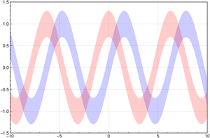
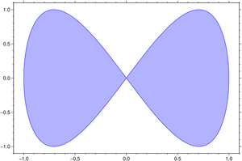
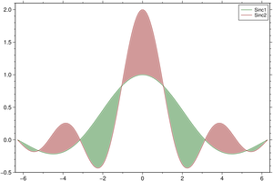

# Filled curves

<style>
.card {
  transition: transform 0.2s ease, box-shadow 0.2s ease;
  cursor: pointer;
  border: 1px solid rgba(0,0,0,.125);
  height: 100%;
}
.card:hover {
  transform: translateY(-5px);
  box-shadow: 0 8px 16px rgba(0,0,0,0.2);
}
.card-img-top {
  width: 100%;
  height: auto;
  object-fit: cover;
}
</style>

<div class="grid">

<div class="g-col-6 g-col-md-4 g-col-lg-3">
<div class="card h-100">
<a href="02_1filledlines.html#band-plots"></a>
<div class="card-body"><a href="02_1filledlines.html#band-plots" class="card-title"><strong>Band Plots</strong></a></div>
</div>
</div>

<div class="g-col-6 g-col-md-4 g-col-lg-3">
<div class="card h-100">
<a href="02_1filledlines.html#papillon"></a>
<div class="card-body"><a href="02_1filledlines.html#papillon" class="card-title"><strong>Papillon</strong></a></div>
</div>
</div>

<div class="g-col-6 g-col-md-4 g-col-lg-3">
<div class="card h-100">
<a href="02_1filledlines.html#fill-between"></a>
<div class="card-body"><a href="02_1filledlines.html#fill-between" class="card-title"><strong>Fill Between</strong></a></div>
</div>
</div>

</div>

## Band plots

The GMT *plot* module has a huge number of options. The *polygon* (-L in original) option in itself
is what other packages call `band`, so we wrapped another avatar around it and with that name too.


```{julia}
using GMT
x = -10:0.11:10;
band(x, sin.(x)./x, width=0.1, fill="green@80", show=true)
```


We could have obtained the same plot using a function as argument.

```julia
band(x->sin(x)/x, 10, width=0.1, fill="green@80", show=true)
```

Next example hides the line and plots only the bands. Since when we ask for a color fill the lines is always
plotted, the trick to no see it is to assign it full transparency. We use also a theme to change the default
tick orientation and add automatic grid lines.


```{julia}
using GMT
x = -10:0.1:10;
band(x, sin.(x), region=(-10,10,-1.5,1.5), width=0.3, pen=(0,"blue@100"),
     fill="blue@80", theme=("A2atgIT"))
band!(x, cos.(x), width=0.3, pen=(0,"red@100"), fill="red@80", show=true)
```


And another example where the band is asymetric and grows in width. We had to add `eps()` to first `x`
to not have a NaN in first element of `y`.


```{julia}
using GMT
x = 0+eps():0.05:4π
y =  sin.(3x) ./ (cos.(x) .+ 2)./x
band([x y], y .- 0.1 .- 0.015x, y .+ 0.1 .+ 0.03x, fill="blue@80", show=true)
```


## Papillon


```{julia}
using GMT
plot(sin, x->sin(2x), [0 2pi], fill="blue@70", pen=(1,"blue@40"), show=1)
```


## Fill between

Fill the area between the two sinc functions. Here we use the default values for line thickness
and fill color but all of that can be changed. We also add a thin white border arround tke lines.


```{julia}
using GMT
theta = linspace(-2π, 2π, 150);
y1 = sin.(theta) ./ theta;
y2 = sin.(2*theta) ./ theta;
fill_between([theta y1], [theta y2], white=true, legend="Sinc1,Sinc2", show=1)
```


```{julia}
using GMT
D = gmtread(TESTSDIR * "assets/1635541200000.dat");
D.attrib["Timecol"] = "1";         # Inform that first column has Time
fill_between(D, figsize=(16,9), yaxis=(annot=20,), theme="A0XYag", show=true)
```
