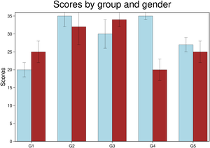
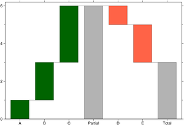
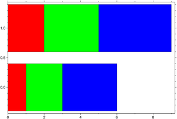
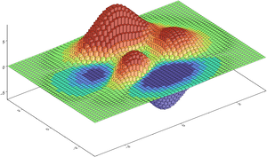

# Bar plots

<style>
.card {
  transition: transform 0.2s ease, box-shadow 0.2s ease;
  cursor: pointer;
  border: 1px solid rgba(0,0,0,.125);
  height: 100%;
}
.card:hover {
  transform: translateY(-5px);
  box-shadow: 0 8px 16px rgba(0,0,0,0.2);
}
.card-img-top {
  width: 100%;
  height: auto;
  object-fit: cover;
}
</style>

<div class="grid">

<div class="g-col-6 g-col-md-4 g-col-lg-3">
<div class="card h-100">
<a href="03_bars.html#examples"></a>
<div class="card-body"><a href="03_bars.html#examples" class="card-title"><strong>Bar Examples</strong></a></div>
</div>
</div>

<div class="g-col-6 g-col-md-4 g-col-lg-3">
<div class="card h-100">
<a href="03_bars.html#a-waterfall-chart"></a>
<div class="card-body"><a href="03_bars.html#a-waterfall-chart" class="card-title"><strong>Waterfall Chart</strong></a></div>
</div>
</div>

<div class="g-col-6 g-col-md-4 g-col-lg-3">
<div class="card h-100">
<a href="03_bars.html#horizontal-bar-plots"></a>
<div class="card-body"><a href="03_bars.html#horizontal-bar-plots" class="card-title"><strong>Horizontal Bars</strong></a></div>
</div>
</div>

<div class="g-col-6 g-col-md-4 g-col-lg-3">
<div class="card h-100">
<a href="03_bars.html#make-a-3d-bar-plot-with-constant-color"></a>
<div class="card-body"><a href="03_bars.html#make-a-3d-bar-plot-with-constant-color" class="card-title"><strong>3D Bars</strong></a></div>
</div>
</div>

</div>

## Examples

A simple bar plot showing color and bar width (in data units) assignement.


```{julia}
using GMT
bar(1:5, (20, 35, 30, 35, 27), width=0.5, color=:lightblue,
    limits=(0.5,5.5,0,40), show=true)
```


A colored bar plot with colors proportional to bar heights. In this case we let the plot limits be determined from data. We also plot a colorbar by using the **colorbar**=*true* option.


```{julia}
using GMT
bar(rand(15), color=:turbo, figsize=(14,8), title="Colored bars",
    colorbar=true, show=true)
```


Example showing how to plot bar groups and at same time assign variable transparency to each of the group's *band* usinf the **fillalpha** option. Here, each row on the input data represents a bar group that has as many *bands* as n_columns - 1. -1 because first column must hold the *xx* coordinates of each group. The colors come from the automatic cyclic scheme.


```{julia}
using GMT
bar([0. 1 2 3; 1 2 3 4], fillalpha=[0.3 0.5 0.7], show=true)
```


And we can also make plots with bar groups where each group has a variable number of bars.
For that, pass NaN's in place of the missing bars for a particular group. For example:


```{julia}
using GMT
bar([2 0.5 1 NaN 1; 4 NaN NaN 2 NaN; 1 3 4 3 2; NaN 3 NaN 1 2], fillalpha=[0.3 0.5 0.7],
    xticks=(:d1, :d2, :d3, :d4), show=true)
```


Next example shows how to plot error bars in a grouped bar. Similar to this [mapplotlib's example](https://matplotlib.org/3.1.1/gallery/lines_bars_and_markers/barchart.html#sphx-glr-gallery-lines-bars-and-markers-barchart-py) (labels will come later).


```{julia}
using GMT
bar(1:5, [20 25; 35 32; 30 34; 35 20; 27 25], width=0.7, fill=["lightblue", "brown"],
    error_bars=(y=[2 3; 3 5; 4 2; 1 3; 2 3],),
    xticks=(:G1, :G2, :G3, :G4, :G5), yaxis=(annot=5,label=:Scores),
    frame=(title="Scores by group and gender", axes=:WSrt), show=true)
```


Example of a verticaly stacked bar plot. In this exampled we pass the *xx* coordinates as first argument and the individual bar heights in a matrix with smae number of rows as the number of elements in the *x* vector. To make it plot a stracked bar we used the option **stacked**=*true*.


```{julia}
using GMT
bar(1:3,[-5 -15 20; 17 10 21; 10 5 15], stacked=1, show=true)
```


## A waterfall chart


```{julia}
using GMT
bar([1 2 3 0 -1 -2 0], stacked=:water, connector=true, bargap=25,
    xticks=(:A, :B, :C, :Partial, :D, :E, :Total), show=true)
```


## Horizontal bar plots

To create an horizontal bar plot we use the **hbar**=*true* option


```{julia}
using GMT
bar([0. 1 2 3; 1 2 3 4], hbar=true, show=true)
```


And one horizontally stacked but this time we pick the colors.


```{julia}
using GMT
bar([0. 1 2 3; 1 2 3 4], stack=true, hbar=true, fill=["red", "green", "blue"], show=true)
```


## Make a 3D bar plot with constant color


```{julia}
using GMT

#Create a 3x3 grid
G = gmt("grdmath -R0/2/0/2 -I1 X Y R2 NEG EXP X MUL =");

# Plot that grid as 3D prisms
bar3(G,                 # 'G' is the grid created above
     fill=[0,115,190],  # Fill prisms with this RGB color
     lw=:thinnest,      # Line thickness (0.25 pt)
     show=true)         # Display the figure.
```


#### Plot a grid as 3D prisms.


```{julia}
using GMT

G = GMT.peaks();      # Create a 'peaks' grid
cmap = grd2cpt(G);    # Colormap with the grid's data range

bar3(G,               # 'G' is the grid created above
     lw=:thinnest,    # Line thickness (0.25 pt)
     color=cmap,      # Paint the prisms with colormap computed from grid
     show=true)       # Display the figure.
```

