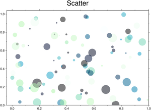
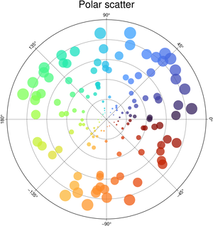
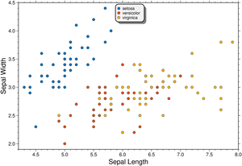

# Scatters

<style>
.card {
  transition: transform 0.2s ease, box-shadow 0.2s ease;
  cursor: pointer;
  border: 1px solid rgba(0,0,0,.125);
  height: 100%;
}
.card:hover {
  transform: translateY(-5px);
  box-shadow: 0 8px 16px rgba(0,0,0,0.2);
}
.card-img-top {
  width: 100%;
  height: auto;
  object-fit: cover;
}
</style>

<div class="grid">

<div class="g-col-6 g-col-md-4 g-col-lg-3">
<div class="card h-100">
<a href="040_scatter.html#using-x-and-y-vectors"></a>
<div class="card-body"><a href="040_scatter.html#using-x-and-y-vectors" class="card-title"><strong>X and Y Vectors</strong></a></div>
</div>
</div>

<div class="g-col-6 g-col-md-4 g-col-lg-3">
<div class="card h-100">
<a href="040_scatter.html#polar-scatter"></a>
<div class="card-body"><a href="040_scatter.html#polar-scatter" class="card-title"><strong>Polar Scatter</strong></a></div>
</div>
</div>

<div class="g-col-6 g-col-md-4 g-col-lg-3">
<div class="card h-100">
<a href="040_scatter.html#group-scatters"></a>
<div class="card-body"><a href="040_scatter.html#group-scatters" class="card-title"><strong>Group Scatters</strong></a></div>
</div>
</div>

</div>

## Examples

### Using x and y vectors

Draw a Cartesian scatter plot with variable symbol size, color and transparency


```{julia}
using GMT
scatter(rand(100),rand(100),   # Generate data
        markersize=rand(100),  # Symbol sizes
        marker=:c,             # Plot circles
        color=:ocean,          # Color scale
        zcolor=rand(100),      # Assign color to each symbol
        alpha=50,              # Set transparency to 50%
        title="Scatter",       # Fig title
        show=true)             # Display the figure
```


### Polar scatter

Draw a Polar scatter plot with variable symbol size, color and transparency. We will use the default color scale
(turbo) and fig size (12 cm).


```{julia}
using GMT
teta = 2pi*rand(150)*180/pi; r = 9*rand(150); ms = r / 10;

scatter(teta, r,                  # The data
	limits=(0,360,0,10),      # Fig limits
        xaxis=(annot=45,grid=45), # Annotate and plor grid lines every 45 deg
        yaxis=(annot=2,grid=2),   # Same but for 2 units in radial direction
        proj=:Polar,              # Set the polar projection
        zcolor=teta,              # Assign color to each symbol
        size=ms,                  # The symbl sizes
        alpha=25,                 # Set transparency to 50%
        title="Polar scatter",    # Fig title
        show=true)                # Display the figure
```


### Group scatters

Split the different species in the ``iris`` dataset in its own colored groups. Use the first two columns
in dataset and label the axes with their column names. 


```{julia}
using GMT
scatter(TESTSDIR * "assets/iris.dat", xvar=1, yvar=2, hue="Species", xlabel=:auto, ylabel=:auto,
        legend=(pos=:TC, box=(pen=1, fill="gray95", shade=true, rounded=true)), show=true)
```

