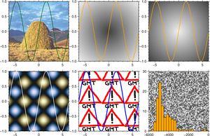
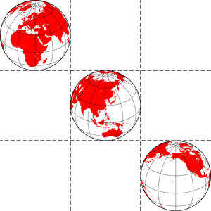
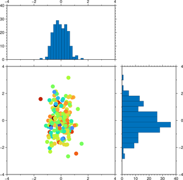

# Subplots

See  docs

<style>
.card {
  transition: transform 0.2s ease, box-shadow 0.2s ease;
  cursor: pointer;
  border: 1px solid rgba(0,0,0,.125);
  height: 100%;
}
.card:hover {
  transform: translateY(-5px);
  box-shadow: 0 8px 16px rgba(0,0,0,0.2);
}
.card-img-top {
  width: 100%;
  height: auto;
  object-fit: cover;
}
</style>

<div class="grid">

<div class="g-col-6 g-col-md-4 g-col-lg-3">
<div class="card h-100">
<a href="01_subplots.html#background-images"></a>
<div class="card-body"><a href="01_subplots.html#background-images" class="card-title"><strong>Background Images</strong></a></div>
</div>
</div>

<div class="g-col-6 g-col-md-4 g-col-lg-3">
<div class="card h-100">
<a href="01_subplots.html#geo-tic-tac-toe"></a>
<div class="card-body"><a href="01_subplots.html#geo-tic-tac-toe" class="card-title"><strong>Geo Tic-Tac-Toe</strong></a></div>
</div>
</div>

<div class="g-col-6 g-col-md-4 g-col-lg-3">
<div class="card h-100">
<a href="01_subplots.html#side-histograms"></a>
<div class="card-body"><a href="01_subplots.html#side-histograms" class="card-title"><strong>Side Histograms</strong></a></div>
</div>
</div>

</div>

## Background images

The examples in the panels of this subplot are intended to demonstrate the **background** option
that paints the canvas with either an external figure or one created internally, and which is described
in the  manual. Note that in panel (2,2) we are painting with the *frame* option *bg*,
which does the fill with a pattern repetition instead of filling with a single image.


```{julia}
using GMT
x = -2π:0.1:2π
subplot(grid="2x3", panels_size=6, region=(-2π, 2π, -1, 1), frame=:WSen, margins=0.2)
	plot(x, sin.(x), lw=1, lc=:darkgreen, bg="@needle.jpg")
	plot(x, sin.(x), lw=1, lc=:orange,    bg=:circ, panel=(1,2))
	plot(x, sin.(x), lw=1, lc=:orange,    bg="-circ", panel=(1,3))
	plot(x, sin.(x), lw=1, lc=:white,     bg=(:eggs, :lisbon), panel=(2,1))
	plot(x, sin.(x), lw=2, lc=:blue,      frame=(bg=(pattern="@warning.png",),), panel=(2,2))
	basemap(region=(-6000,0,0,30), panel=(2,3))
	histogram("@v3206_06.txt", fill=:orange, pen=0.5, kind=(freq=true,), bin=250, bg=mat2grid(rand(64,64))) 
subplot(:show)
```


## Geo Tic-Tac-Toe


```{julia}
using GMT
subplot(grid="3x3", dims=(panels=(5,),divlines=(1,:dashed)), axes=(axes=:lrbt,), margins=0);
    coast(region=:global, proj=(name=:Ortho, center=(30 ,30)), land=:red, B=:g, panel=(1,1));
    coast(region=:global, proj=(name=:Ortho, center=(120,30)), land=:red, B=:g, panel=(2,2));
    coast(region=:global, proj=(name=:Ortho, center=(210,30)), land=:red, B=:g, panel=(3,3));
subplot(:show)
```


## Side histograms


```{julia}
using GMT
subplot(grid="2x2", dims=(size=(15,15), frac=((10,5),(5,10))),
        col_axes=true, row_axes=true)
    n = 200;
    x, y, color = randn(n)/2, randn(n), randn(n);
    histogram(x, limits=(-4,4,0,40), binmethod="sqrt", panel=(1,1));
    scatter(x,y, limits=(-4,4,-4,4), marker=:circ, ms="10p", zcolor=color, panel=(2,1));
    histogram(y, limits=(-4,4,0,40), horizontal=true, binmethod="sqrt", panel=(2,2));
subplot(:show)
```

